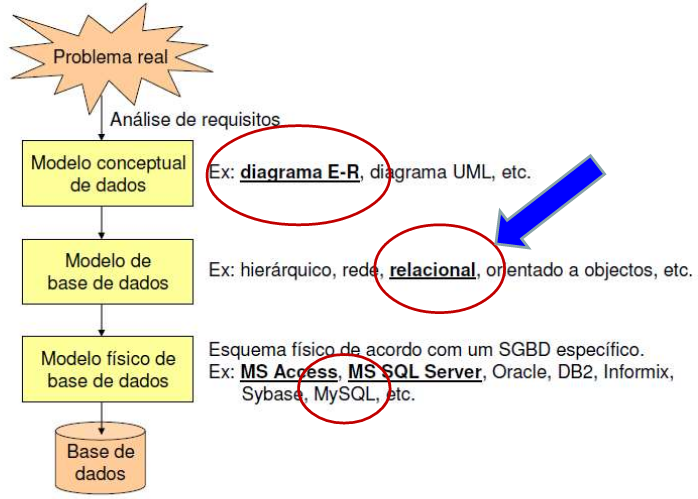

- [Data modeling](#org2dfff54)
- [E-R diagram](#orge7e057c)
- [Logical design](#orgece236a)
- [Relational languages](#orgfaad13e)
  - [SQL](#org9a26a44)
    - [Intro](#orgd11964a)
    - [DDL: Data definition language](#org7b85383)
    - [DML: Data modeling language](#orgdfe0fff)
    - [Views](#orgb690595)


<a id="org2dfff54"></a>

# Data modeling

-   A modelação de dados justifica-se porque várias aplicações podem partilhar o mesmo conjunto de dados.
-   A base de dados serve as aplicações já existentes, mas deve estar preparada para servir as aplicações que venham a ser desenvolvidas no futuro (dentro da organização).
-   A identificação dos dados necessários depende dos requisitos de informação do Sistema de Informação (SI) que a base de dados pretende suportar (e não exclusivamente das necessidades de processamento de cada aplicação)

<span class="underline">Etapas</span>:

1.  <span class="underline">Desenho conceptual</span>: consiste na construção do modelo conceptual de dados, o qual reflecte a percepção que os utilizadores têm dos dados, sendo independente de qualquer implementação física.
    -   A abordagem mais utilizada são os diagramas DER (Diagramas de Entidades e Relacionamentos).
2.  <span class="underline">Desenho lógico</span>: Corresponde à transformação do modelo conceptual em estruturas de dados que são implementáveis no SGBD (sistema de gestão de bases de dados) seleccionado.
    -   O modelo relacional tem sido o modelo mais utilizado na construção de modelos lógicos de dados.
3.  <span class="underline">Desenho físico</span>: Passa pela definição dos detalhes físicos que serão considerados na implementação do modelo lógico, e que são específicos do SGBD com que se vá trabalhar (MySQL nesta Unidade Curricular).
    
    


<a id="orge7e057c"></a>

# E-R diagram

Os diagramas E-R são utilizados para descrever a estrutura dos dados, específica de uma dada aplicação ou SI.

-   <span class="underline">Componentes básicos</span>:
    1.  <span class="underline">Entidades</span>: constituem objectos ou conceitos de interesse no domínio de aplicação em causa (Ex: objeto do negócio, atores envolvidos, documentos que circulam na organização,&#x2026;).
    2.  <span class="underline">Relacionamentos</span>: representam associações entre entidades.
    3.  <span class="underline">Atributos</span>: os atributos de uma entidade ou relação definem propriedades, assumindo valores dentro do contexto definido para o domínio de aplicação modelado (caraterizam a entidade).
-   <span class="underline">Representacao grafica</span>:
    -   <span class="underline">Entidades</span>: retângulos
    -   <span class="underline">atributos</span>: elipses
    -   <span class="underline">relacionamentos</span>: linhas entre as entidades.
    -   Nos retângulos e nas elipses colocam-se os nomes das diferentes entidades e atributos.
    -   As linhas apresentam setas que definem o sentido da relação e cuja forma caracteriza o tipo de relacionamento existente entre duas entidades (há outras representações para os relacionamentos, com outras semânticas).
    -   <span class="underline">cardinalidade</span>: indica a quantidade no relacionamento:
        -   1:1: um para um
        -   1:M: um para muitos
        -   M:N: muitos para muitos
    -   <span class="underline">opcionalidade</span>:
        -   0: opcional
        -   1: obrigatório
            
             <fig:diag-er>")  <fig:diag-er>")


<a id="orgece236a"></a>

# Logical design

-   <span class="underline">Modelação lógica</span>: transformacao do modelo conceptual de dados num modelo de BD (neste caso relacional)
    -   <span class="underline">Chave primária</span>: Conjunto de atributos, eventualmente singular, que quando conhecidos valores específicos dos mesmos, permite o acesso unívoco à instância da relação (entidade no modelo concetual) a que pertencem tais valores.
        -   Uma chave primaria nao pode ter conteudo nulo!!!
    -   <span class="underline">Chave secundária</span>: Atributo(s) que num relacionamento de “um para muitos” é(são) chave primária na entidade do lado “um” no relacionamento, e integra o conjunto de atributos da entidade no lado “muitos” desse relacionamento.
        -   Se uma relação contiver uma chave estrangeira com conteúdo não nulo, então terá que existir um registo na relação onde é chave primária, com conteúdo não nulo!
    -   <span class="underline">Regras de transformacao</span> (nao necessariamente por esta ordem)
        1.  Cada entidade no modelo conceptual dará origem a uma relação (tabela aquando da criação da base de dados) no modelo relacional, cujos atributos são os atributos da entidade no modelo concetual de dados;
            -   Nota: relação é diferente de relacionamento!
        2.  Para cada relação, de entre as chaves candidatas que possam existir, selecionar a chave primária. As restantes passam a ser chaves secundárias;
        3.  Recorrendo à cardinalidade dos relacionamentos estabelecidos no modelo conceptual:
            1.  <span class="underline">Para cada relacionamento de muitos para muitos (M:N)</span> cria-se uma nova relação (já temos no horizonte o modelo relacional de base de dados!) cujos atributos terão que incluir os atributos correspondentes às chaves primárias das relações envolvidas;
            2.  <span class="underline">Relacionamentos de um para um (1:1)</span> tendem a dar origem a uma única relação que, fundindo as entidades envolvidas nesse relacionamento, será constituída pelos atributos de ambas.
                1.  Quando não for possível, ou aconselhável, fazer a fusão das duas entidades, uma das duas relações deve importar a chave primária da outra relação;
            3.  <span class="underline">Relacionamentos de um para muitos (1:N)</span> implicam a importação, para a relação correspondente à entidade (no MCD) do lado “muitos”, do(s) atributo(s) chave primária da relação que corresponde à entidade do lado “um”;
        4.  Identificação das chaves primária e estrangeiras:
            1.  Os atributos que constituem a chave primária de uma relação devem ser sublinhados a cheio;
            2.  Os atributos que constituem as chaves estrangeiras de uma relação devem ser sublinhados a tracejado;
    -   <span class="underline">Exemplos</span>: Utilizando as regras de transformação de modelos conceptuais de dados em modelos relacionais, desenvolva os esquemas relacionais correspondentes aos exercícios vistos anteriormente:
        1.  Contexto escolar;
            
             e modelo logico (dir.) <fig:mod-logico1>")  e modelo logico (dir.) <fig:mod-logico1>")
        2.  Contexto bancário
            
             e modelo logico (dir.) <fig:mod-logico2>")  e modelo logico (dir.) <fig:mod-logico2>")


<a id="orgfaad13e"></a>

# Relational languages

> -   Baseadas na Álgebra Relacional e, sobretudo, no Cálculo Relacional
> -   Linguagens:
>     1.  SQL: mais representativa
>     2.  QBE (Query By Example):
>         -   Marcas possíveis em QBE: P. I. D. U.
>             -   a marca P. é usada para apresentação de resultados (Present)
>             -   a marca I. é usada para inserção de tuplos (insert)
>             -   a marca D. é usada para remoção de tuplos (Delete)
>             -   a marca U. é usada para alteração de tuplos (Update)
>     3.  Calculo relacional de dominios


<a id="org9a26a44"></a>

## SQL


<a id="orgd11964a"></a>

### Intro

1.  Linguagem declarativa:
    -   especifica-se (declara-se) o que se quer fazer;
    -   nao se especifica como se faz (como em C ou noutra linguagem procedimental ou imperativa), apenas o que se pretende)
2.  Formato base duma query SQL
    
    ```sql
    -- A “where clause” pode não existir na interrogação (query). 
    -- Daí surgir entre parêntesis retos.
    	    SELECT <colunas>
    	    FROM <tabelas>
    	    [WHERE <condição>]
    
    -- Exemplos
    	    -- 1.
    	    SELECT nome
    	    FROM alunos
    	    WHERE localidade = 'Guimarães' 
    	    -- Algebra relacional
    	    -- Proj<nome>(Sel<localidade = 'Guimarães'> (Alunos) )
    
    	    -- 2.
    	    SELECT nome
    	    FROM alunos
    	    -- Algebra relacional
    	    -- Proj<nome>( Alunos )
    ```
3.  Comandos:
    1.  Para definir a BD: Ling. de Def. de Dados (LDD)
    2.  Para manipular dados: Ling. de Manipulação de Dados (LMD)
        1.  Interrogacao de BDs
        2.  Update de BDs
    3.  Para administrar a BD: segurança, optimizacao, etc.


<a id="org7b85383"></a>

### DDL: Data definition language

1.  Comandos
    1.  Criacao de BD
    2.  Modificacao de BD
    3.  Remocao de BD
2.  Tipos de dados (dominios) dos campos
3.  Constraints: Assegurar a integridade dos dados
    1.  Restricoes de Integridade Implicitas
        1.  Integridade de dominio
            1.  `DEFAULT`: indicacao dos valores por defeito, por omissao, a aplicar num campo: `tipo varchar(3) DEFAULT 'ORD'`
            2.  `NOT NULL`: indicacao de que o conteudo dum campo nao pode ser nulo: `nome varchar(100) NOT NULL`
            3.  `UNIQUE`: indicacao de que o conteudo dum campo nao pode ser repetido: `nome varchar(100) UNIQUE`
            4.  `CHECK`: impoe uma condição para o valor do campo ser aceite. Pode usar os operadores:
                1.  Relacionais: `, >, <, >`, <=, <> ou !=
                2.  Logicos: AND, OR, NOT
                3.  Outros: BETWEEN, IN, IS, LIKE
                    
                    ```sql
                    	genero varchar(1) CHECK (genero = 'M' or genero = 'F')
                    
                    CREATE TABLE Professor(
                    Id INTEGER NOT NULL,
                    Nome CHAR(50) NOT NULL CHECK(Nome NOT LIKE '%Rui'),
                    Idade INTEGER NOT NULL CHECK(Idade BETWEEN 0 AND 150),
                    Sexo CHAR NOT NULL CHECK(SEXO IN ('M', 'F')),
                    Salario FLOAT NOT NULL CHECK(Salario >= 0),
                    Data_Nasc DATE NOT NULL,
                    Data_Admi DATE NOT NULL,
                    CHECK(Data_Admi > Data_Nasc)
                    );
                    ```
        2.  Integridade ao nivel da entidade
            1.  Cada relacao ou tabela (entidade) deve ter definida uma unica chave primaria
            
            2.  Numa relacao ou tabela, um conteudo da chave primaria é unico
            
            3.  A chave primaria nao pode ser nula
                1.  `PRIMARY KEY`: indica qual a chave primaria da tabela. Implica que o campo nao pode ser nulo e um conteudo desse campo tem que ser unico.
        3.  Entidade referencial
            1.  Conceito de chave estrangeira: atributos que nao sao chave primaria duma tabela, mas sao chave primaria noutra tabela
            
            2.  Ao valor duma chave estrangeira deverá corresponder um valor da chave primária na tabela respectiva.
            3.  Pode admitir o valor `null`
            4.  Restricao `FOREIGN KEY` + `REFERENCES`
                
                ```sql
                CREATE TABLE Professor(
                Id INTEGER,
                Nome CHAR(50) NOT NULL CHECK(Nome NOT LIKE '%Rui'),
                BI NUMERIC NOT NULL UNIQUE,
                Morada CHAR(80),
                Cod_Postal NUMERIC(4) REFERENCES Postal(Codigo)
                Salario NUMERIC(10,2) NOT NULL CHECK(Salario >= 0),
                PRIMARY KEY (Id),
                FOREIGN KEY (BI) REFERENCES Seg_Social(BId),
                FOREIGN KEY (Nome, Apelido) REFERENCES Pessoa(Nome, Apelido),
                );
                ```
            5.  Pode definir-se a atualizacao das tabelas onde estao definidas as chave estrangeiras, i.e., `UPDATE` ou `DELETE`
                
                ```sql
                CREATE TABLE Funcionarios(
                ...,
                cod_dep CHAR(3),
                FOREIGN KEY (cod_dep)
                REFERENCES Departamentos (cod_dep)
                ON UPDATE CASCADE
                ON DELETE SET NULL,
                );
                ```
    2.  Restricoes de Integridade Explicitas: regras impostas pelo negocio ou contexto (ex. livros para adultos)
        1.  Muitas podem ser implementadas com restricoes de dominio
        2.  Outros so atraves de codigo aplicacional ou triggers na base de dados
    3.  `CONSTRAINT`: acrescenta restricoes que podem ser manipuladas directamente atraves do seu nome: `CONSTRAINT chave_pr PRIMARY KEY(numero)`
4.  **LDD: Exemplo Completo**:
    
    ```sql
    	    CREATE TABLE CONTAS (
    	    num_conta CHAR(10),
    	    tipo_conta CHAR(5),
    	    cod_agencia CHAR(3),
    	    cod_cliente CHAR(4) NOT NULL,
    	    saldo DECIMAL(10,2) NOT NULL,
    	    CONSTRAINT tipos_de_contas
    	      CHECK (tipo_conta IN ('ordem','prazo')),
    	    CONSTRAINT valor_saldo CHECK (saldo >= 10000),
    	    CONSTRAINT ch_prim_Contas
    	      PRIMARY KEY (num_conta),
    	    CONSTRAINT ch_estr_Agencias_Contas
    	      FOREIGN KEY (cod_agencia)
    	      REFERENCES Agencias (cod_agencia)
    	      ON UPDATE CASCADE
    	      ON DELETE SET NULL,
    	    CONSTRAINT ch_estr_Clientes_Contas
    	      FOREIGN KEY (cod_cliente)
    	      REFERENCES Clientes (cod_cliente)
    	      ON UPDATE CASCADE
    	      ON DELETE CASCADE
    	    );
    
    	    CREATE TABLE Emprestimos (
    	    num_emprestimo CHAR(5),
    	    cod_agencia CHAR(3),
    	    cod_cliente CHAR(4) NOT NULL,
    	    valor INTEGER NOT NULL,
    	    CONSTRAINT valor_emprestimo
    	      CHECK (valor BETWEEN 100000 AND 100000000),
    	    CONSTRAINT ch_prim_Emprestimos
    	      PRIMARY KEY (num_emprestimo),
    	    CONSTRAINT ch_estr_Agencias_Emprestimos
    	      FOREIGN KEY (cod_agencia)
    	      REFERENCES Agencias (cod_agencia)
    	      ON UPDATE CASCADE
    	      ON DELETE SET NULL,
    	    CONSTRAINT ch_estr_Clientes_Emprestimos
    	      FOREIGN KEY (cod_cliente)
    	      REFERENCES Clientes (cod_cliente)
    	      ON UPDATE CASCADE
    	      ON DELETE CASCADE
    	    ) ;
    
    	    CREATE TABLE Agencias (
    	    cod_agencia CHAR(3),
    	    agencia VARCHAR(20) NOT NULL,
    	    localidade VARCHAR(10) NOT NULL,
    	    CONSTRAINT ch_candidata_Agencias
    	      UNIQUE (agencia),
    	    CONSTRAINT ch_prim_Agencias
    	      PRIMARY KEY (cod_agencia)
    	    );
    
    	    CREATE TABLE Clientes (
    	    cod_cliente CHAR(4),
    	    cliente VARCHAR(30) NOT NULL,
    	    profissao VARCHAR(10),
    	    localidade VARCHAR(10) NOT NULL,
    	    CONSTRAINT ch_prim_Clientes
    	      PRIMARY KEY (cod_cliente)
    	    );
    
    /* Alterar estrutura de tabelas */
    --     Adicionar coluna
    	    ALTER TABLE Clientes
    	      ADD COLUMN nacionalidade VARCHAR(15)
    	      DEFAULT 'portuguesa' [FIRST| AFTER <coluna>] ;
    --     Modificar coluna
    	    ALTER TABLE Clientes
    	      MODIFY COLUMN nacionalidade VARCHAR(25) ;
    --     Remover coluna
    	    ALTER TABLE Clientes
    	      DROP COLUMN nacionalidade ;
    
    /* Remover tabelas */
    DROP TABLE Clientes;
    ```


<a id="orgdfe0fff"></a>

### DML: Data modeling language

1.  Comandos

    1.  Insert
        
        ```sql
        	 /* ========== INSERT ============== */
        	 -- INSERT INTO <tabela> [(<colunas>)]
        	 -- VALUES (<valores>)
        	 INSERT INTO Clientes 
        	 VALUES 
        	 ('1234','J.Silva','Estudante','Braga'),
        	 ('5678','F.Gomes','Estudante','Guimarães'),
        	 ('4321','A.Pires','Estudante','Taipas')
        	 ;
        
        	 INSERT INTO Clientes
        	   (cod_cliente, cliente, localidade)
        	 VALUES 
        	   ('1235','A.Costa','Guimarães'),
        	   ('9876','C.Pereira','Guimarães'),
        	   ('4256','D.Silveira','Porto')
        	 ;
        
        	 -- After using select
        /* In this case, the records inserted into table Contas_Prazo are those
         * resultant from the SELECT over the table Contas, including the fields
         * indicated (num_conta and saldo)
         */
        	 INSERT INTO Contas_Prazo (num_conta, saldo)
        	   SELECT (num_conta, saldo)
        	   FROM Contas
        	   WHERE saldo < 15000;
        ```
        
        1.  auto<sub>increment</sub>
            1.  Se o esquema duma tabela contiver a definicao dum campo chave primária do tipo `int` como `auto_increment`, tal campo terá:
                1.  valor inicial: 1
                2.  será incrementado de 1 por cada novo registo inserido da tabela
            2.  A remocao de registos nessa tabela NAO altera o contador automatico associado a esse campo
            3.  Para iniciar um campo AUTO<sub>INCREMENT</sub> com valor diferente de 1, usa-se:
                
                ```sql
                     -- <valor_inicial> tem que ser > 0
                     ALTER TABLE <nome_tabela> AUTO_INCREMENT = <valor_inicial>
                
                /* ================ Example ===================== */
                     Create table clientes (
                     id_cliente int auto_increment primary key,
                     cliente varchar(50),
                     profissao varchar(25),
                     localidade varchar(500)
                     );
                -- a funcionalidade auto_increment aplicada ao campo id_cliente pode 
                -- ser invocada de 2 formas:
                  -- 1. Conteudo NULL no campo id_cliente
                    INSERT INTO Clientes VALUES
                      (null, 'J.Silva', 'Estudante', 'Braga');
                  -- 2. Nao referencia ao atributo id_cliente, se indicados os atributos
                  -- que vao ter conteudos no INSERT
                    INSERT INTO Clientes
                      (cliente, profissao, localidade)
                    VALUES
                      (null, 'J.Silva', 'Estudante', 'Braga');
                
                /* Notas:
                *   1. A insercao dum novo registo na tabela Clientes admite um valor
                * diferente de NULL no campo id_cliente, desde que numerico inteiro.
                *   2. O registo seguinte que solicitar o autoincremento do atributo
                * id_cliente, receberá nesse campo o conteudo que o SGBD determinar,
                * que pode ser 1 de 2 valores:
                *     1. Se cada registo inserido na tabela tiver usado o valor NULL
                *        para o primeiro campo, o valor calculado pelo SGBD será o 
                *        inteiro a seguir ao do ultimo registo inserido
                *     2. Se o utilizador tiver inserido um registo com o valor do campo 
                *       id_cliente fora da sequencia normal que o SGBD seguiria, o valor
                *       calculado pelo SGBD será o inteiro a seguir ao que o utilizador 
                *       tiver utilizado, alterando a ordem normal!
                */
                ```
        2.  Funcao `LAST_INSERT_ID`
            
            ```sql
            INSERT INTO tabela (chave_primaria, col1, col2)
              VALUES (null, 'aaa', 'bbb');
            
              -- armazenar o ultimo id inserido na variavel xpto
            SELECT LAST_INSERT_ID() INTO @xpto;
            
              -- inserir noutra tabela usando xpto
            INSERT INTO outra_tabela (chave_estrang, col3, col4)
              VALUES( @xpto + 1, 'xxx', 'yyy');
            ```
    2.  Update
        
        ```sql
        UPDATE <tabela>
        SET <coluna> = <expr>,
        ....
        [WHERE <condicao>]
        
        UPDATE Contas
        SET saldo = saldo + 1000
        WHERE num_conta  = '123456';
        
        -- update de todas as contas do cliente 1234, passando o saldo de 
        -- cada uma delas a ter o valor do saldo max das contas desse cliente
        UPDATE Contas
        SET Saldo = (SELECT MAX(saldo)
        	      FROM Contas
        	      WHERE cod_cliente = '1234')
        WHERE cod_cli = '1234';
        ```
    3.  Delete
        
        ```sql
        DELETE FROM <tabela>
        [WHERE <condicao>]
        
        -- remover todos os cartoes
        delete from cartoes
        
        -- remover 1 conta especifica
        delete from Contas
        WHERE num_conta  = '123456';
        
        -- remover todos os clientes da tabela Clientes
        -- com contas na agencia 123
        delete from Clientes
        where cod_cliente IN (select cod_cliente
        		      from Contas
        		      where cod_agencia = '123');
        ```
    4.  LIMIT: limitar a lista de registos resultantes duma query
        
        ```sql
        -- Devolver as 100 primeiras linhas da tabela Artigos
        -- independentemente do nr total de linhas
        select * from artigos limit 100;
        
        -- Devolver um conj de linhas da tabela Clientes,
        -- comecando no registo 5 e considerando as 7 linhas seguintes
        select * from clientes limit 5, 7;
        
        -- Seleccionar o artigo mais caro da tabela artigo
        select preco_venda
        from artigo
        order by preco_venda DESC
        limit 1
        ```
    5.  Manipular vars em MySQL
        
        ```sql
        -- 1.
        Set @<variável> = valor;
        -- 2.
        Set @<variável> = select <coluna>
        from <tabela>
        where <condição>
        [limit 1];
        -- 3.
        Select <coluna> into @<variável>
        from <tabela>
        where <condição>
        [limit 1];	  
        
        -- Ver/Manipular o conteudo
        select @<variavel>
        ```
    6.  Manipular datas em MySQL
        
        ```sql
        Now() -- Data e hora atuais
        CURDATE() --ou 
        CURRENT_DATE() -- – Data atual
        DATE_FORMAT() -- Formatação de datas
        
        -- Exemplo
        SELECT DATE_FORMAT("2017-06-15", "%M %d %Y");
        /* Formato 
        | Especificação | Descrição                          |
        |----------------------------------------------------|
        | %d            | Dia do mês numérico(00..31)        |
        | %D            | Dia do mês com sufixo (em Inglês)  |
        | %m            | Mês, numérico(00..12)              |
        | %M            | Nome do Mês(em Inglês)             |
        | %y            | Ano, numérico (dois dígitos)       |
        | %Y            | Ano, quatro dígitos numéricos      |
        */
        
        -- Exemplos
        SELECT EXTRACT(DAY FROM CURDATE()) AS DIA,
        SELECT EXTRACT(MONTH FROM CURDATE()) AS MES,
        SELECT EXTRACT(YEAR FROM CURDATE()) AS ANO;
        
        SELECT DATE_ADD(CURDATE(), INTERVAL 10 DAY)
         -- ou
        SELECT DATE_ADD(CURDATE(), INTERVAL 10 DAY)
        as <variável>;
        
        SELECT DATEDIFF('2012-08-21', '2012-08-05');
        
        --                ( YYYYMM,   YYYYMM)
        SELECT PERIOD_DIFF(‘201708’, ‘201703’);
        --                ( YYMM,    YYMM)
        SELECT PERIOD_DIFF(‘1708’, ‘1703’);
        
        
        SELECT DAYOFYEAR('2012-08-21');
        -- Exemplo:
        SELECT DAYOFYEAR(CURDATE());
        -- Resultado: 113
        
        ```
    7.  Funcao `IFNULL(exp1, exp2)`
        
        ```sql
        	  IFNULL (exp1,exp2)
        -- Se exp1 não for NULL ou um valor impossível de calcular, a função
        -- IFNULL retornará exp1, caso contrário, devolverá exp2.
        -- IFNULL devolve um valor numérico ou uma string, dependendo do
        -- contexto em que for usada.
        -- 
        -- O Select é uma das formas de invocacao duma funcao em SQL
        -- Exemplos:
        Select IFNULL(1,0) --- Result: 1;
        Select IFNULL(null, 10) --- Result: 10;
        -- 1/0 nao pode ser calculado
        Select IFNULL(1/0, 10) --- Result: 10;
        Select IFNULL(1/0, ‘yes’) --- Result: ‘yes’
        ```

2.  Adicao de codigo a uma BD

    1.  Delimitador
        
        > O caracter “;” é o terminador de qualquer instrução SQL.
        > 
        > -   Contudo, functions, procedures e triggers não fazem parte da especificação SQL!
        > -   Dado que na escrita de functions, procedures e triggers se utilizam caracteres “;” que fazem parte da sintaxe da linguagem usada para escrever esse código, é necessário dizer ao MySQL para alterar o terminador a que está “habituado” (;).
        > -   Isso faz-se indicando explicitamente um outro caracter qualquer para esse efeito. Deve escolher-se um caracter cuja utilização não seja previsível!
        > 
        > Devemos então incluir nas scripts destinadas a criar procedures, functions e triggers, antes do código que implementa essas unidades de processamento, uma instrução do género: `delimiter @`
        > 
        > -   A partir desse momento, para o MySQL, o caracter que termina as instruções SQL passa a ser o `@`!
        > 
        > Após a execução da script, será necessário “repor” o delimitador habitual do MySQL, através da instrução `delimiter ;`.
    2.  Codigo
        1.  Stored Procedures
            
            ```sql
             -- Sintaxe
             -- Os parâmetros podem ser de três tipos: 
             IN 
             OUT
             INOUT
            
             CREATE PROCEDURE <nome_proc> ([parametros, ...])
             BEGIN
             [<declaração_variáveis>]
             <corpo_procedimento>
             END;
            
            -- Exemplo> Seleccionar as 1as =quantidade= linhas da tab produtos 
            DELIMITER @
            CREATE PROCEDURE Selecionar_Produtos(IN quantidade INT)
            BEGIN
            SELECT *
            FROM PRODUTOS
            LIMIT quantidade;
            END;
            @ -- O delimitador delimita o codigo adicionavel
            DELIMITER ; -- reset do delimitador original
            
            -- Exemplo> Obter a =quantidade= de produtos 
            DELIMITER @
            CREATE PROCEDURE Verificar_Quantidade_Produtos(OUT quantidade INT)
            BEGIN
            SELECT COUNT(*) INTO quantidade
            FROM PRODUTOS;
            END;
            @
            DELIMITER ;
            
            -- Obter um nr. ao quadrado
            DELIMITER @
            CREATE PROCEDURE Elevar_Ao_Quadrado(INOUT numero INT)
            BEGIN
            SET numero = numero * numero;
            END;
            @
            DELIMITER ;
            
            -- Abrir aluguer pg 35
             -- se o campo =num_aluguer= da tabela Alugueres estivesse definido 
             -- como sendo auto increment, não seria  necessário determinar o 
             -- valor da variável aluguer, nem incluir esse campo no insert.
            DELIMITER @
            CREATE PROCEDURE abrir_aluguer( IN socio CHAR(8),
            filme CHAR(5), exemplar CHAR(5),
            modalidade CHAR(1))
            Begin
            -- declaration
            DECLARE n_aluguer INT;
            DECLARE p_mod DECIMAL(4,2); Se o campo num_aluguer da tabela
            -- body
            SELECT MAX(num_aluguer)
              INTO n_aluguer
              FROM alugueres;
            SELECT preco_dia
              INTO p_mod
              FROM modalidades
              WHERE modalid = modalidade;
            INSERT INTO alugueres VALUES(n_aluguer+1, socio, filme, exemplar,
            			     modalidade, curdate(), NULL, p_mod, 
            			     NULL);
            End;
            @
            DELIMITER ;
            
            -- Fechar aluguer
            DELIMITER @
            CREATE PROCEDURE fechar_aluguer( IN aluguer INT )
            Begin
            DECLARE multa_dia DECIMAL(4, 2), modal char(1);
            SELECT modalid
              INTO modal
              FROM alugueres
              WHERE num_aluguer = aluguer;
            SELECT multa_diaria
              INTO multa_dia
              FROM modalidades
              WHERE modalid = modal;
            UPDATE alugueres set data_entrega = curdate(),
            multa = ( now() – data_aluguer – 1 ) * multa_dia
            WHERE num_aluguer = aluguer;
            End;
            @
            DELIMITER ;
            ```
        2.  Stored Functions
            
            ```sql
            --  Parametro: Lista (se houver!) de pares com
            --             nome do parâmetro e o seu tipo de dados.
            -- O <resultado> tera que ser do tipo declarado na clausula RETURNS
            CREATE FUNCTION <nome_func> ([parametro, ...])
            RETURNS <tipo_dados>
            BEGIN
            [<declaração_variáveis>]
            <corpo_função>
            RETURN <resultado>;
            END;
            
            -- Determinar lucro
            DELIMITER @
            CREATE FUNCTION lucro(v_compra FLOAT, v_venda FLOAT)
            RETURNS DECIMAL(9,2)
            BEGIN
            DECLARE lucro DECIMAL(9,2);
            SET lucro = v_venda - v_compra;
            RETURN lucro;
            END;
            @
            DELIMITER ;
            ```
        3.  Stored Triggers
    3.  Inclusao e Invocacao
        1.  <span class="underline">Inclusao</span>: para incluir uma `procedure` ou `function` na BD, será necessário executar da forma habitual as scripts que as definem
        2.  <span class="underline">Invocacao</span>:
            1.  `Procedure`: a invocacao duma `procedure` já adicionada á BD faz-se através do comando `call`. Exemplo: `call listar_artigos`
            2.  `Function`: pode-se invocar de 3 formas
                
                ```sql
                select max_multa(2)                 -- 1
                if (max_multa(5) > 1000) then ...   -- 2
                set x = max_multa(7)                -- 3
                ```
    
    1.  Stored functions
    
        ```sql
        -- EXEMPLO 1: function exemplares_dentro
        -- Escrever uma função “exemplares_dentro” que, dada a identificação de 
        -- um filme (cod_filme), retorne o número de exemplares (de todos os
        -- tipos) desse filme que neste momento não se encontram alugados.
            -- FUNCTION exemplares_dentro: Procedimento
               -- 1. Precisamos de identificar e fornecer:
        	 -- Qual o filme;
               -- 2. Para determinar:
        	 -- Os exemplares que existem;
        	 -- Os exemplares emprestados.
               -- 3. E retornar:
        	 -- A diferença entre os dois valores
               DELIMITER @
               CREATE FUNCTION exemplares_dentro( filme char(5) )
        	 RETURNS INT
        	 Begin
        	   DECLARE existentes, fora INT;
        	   SELECT COUNT( * )
        	     INTO existentes
        	     FROM copias
        	     WHERE cod_filme = filme;
        	   SELECT COUNT( * )
        	     INTO fora
        	     FROM alugueres
        	     WHERE cod_filme = filme AND data_entrega IS NULL;
        	   RETURN ( existentes – fora );
        	 End;
               @
               DELIMITER ;
        
        -- EXEMPLO 2: function multa_a_pagar
        -- Escrever uma função “multa_a_pagar” que, dada a modalidade em que um 
        -- aluguer foi realizado, juntamente com o número de dias em atraso,
        -- retorne o correspondente valor da multa a pagar.
            -- FUNCTION multa_a_pagar: Procedimento
               -- 1. Precisamos de identificar e fornecer:
        	 -- O valor diário da multa, para a modalidade do aluguer;
        	 -- O nº de dias que o filme esteve emprestado
               DELIMITER @
               CREATE FUNCTION multa_a_pagar( aluguer INT )
        	 RETURNS decimal(4,2)
        	   Begin
        	     DECLARE modal CHAR(1);
        	     DECLARE hoje DATE, data_alug DATE;
        	     DECLARE mult_dia DECIMAL(4,2), dias_multa INT;
        	     SELECT modalid, data_aluguer
        	       INTO modal, data_alug
        	       FROM alugueres
        	       WHERE num_aluguer = aluguer;
        	     SELECT multa_diaria
        	       INTO mult_dia
        	       FROM modalidades
        	       WHERE modalid = modal;
        	     SET hoje = curdate();
        	     SET dias_multa = datediff(hoje, data_alug) – 1;
        	     RETURN ( dias_multa * mult_dia );
        	   End;
               @
               DELIMITER ;
        ```
    
    2.  Triggers
    
        > -   Os triggers são blocos de código armazenados na base de dados e associados a uma tabela.
        > -   Podem existir diversos triggers associados a uma mesma tabela.
        > -   Tais blocos de código são executados automaticamente, sempre que ocorrem determinadas atualizações (inserts, updates ou deletes) sobre a tabela em que estão “alicerçados”.
        > -   Este mecanismo permite “aliviar” a camada aplicacional, implementando tarefas ao nível do próprio SGBD!
        > -   Para adicionar um trigger à base de dados, deve executar-se a script que o cria, tendo em atenção os mesmos cuidados referidos anteriormente, quanto ao carater terminador de instruções SQL (delimiter).
        > -   Para testar o funcionamento do trigger, deverá executar-se a operação SQL que provocará a execução desse trigger (por exemplo, um insert).
        > -   Posteriormente será necessário inspeccionar o conteúdo da tabela sobre a qual se executou a operação SQL, no sentido de verificar se o trigger provocou o efeito desejado.
        
        ```sql
            -- Sintaxe:
            --  Neste caso é a tentativa de inserção de um novo registo na tabela 
            -- indicada que vai espoletar a execução do  trigger! Mas poderia ser 
            -- outra operação (p.e. um update ou um delete
               create trigger <nome_trigger>
               <before/after> <insert/delete/update> on <tabela> 
        	      -- before ou after insert, delete ou update.
               for each row
               begin
        	 declare <variáveis>;
        	 <código>
               end;
        
            -- 1. Escrever o código que crie um trigger que implemente a seguinte 
            --    regra de negócio: “todos os clientes com mais de 5 alugueres 
            --    terminados em multa, só poderão fazer novos alugueres na
            --    modalidade mais cara”.
               drop trigger if exists punir_clientes;
               delimiter @
               create trigger punir_clientes 
        	 -- Neste caso é a tentativa de inserção de um novo registo na tabela 
        	 -- alugueres, que vai espoletar a execução do trigger, e o código 
        	 -- associado ao mesmo será executado antes de ser feita a inserção do 
        	 -- registo na tabela.
               before insert on alugueres
               for each row
               begin
        	 declare num_alug_multa int; 
        	 declare preco_max decimal(5,2);
        	 declare modal_mais_cara char(6);
        	 select count(*)
        	   into num_alug_multa
        	   from alugueres
        	   where (n_socio = new.n_socio and multa > 0);
        	   -- * new é uma cópia do registo que acaba de se tentar inserir
        	   --   na tabela alugueres. 
        	   -- * Tem existência temporária e é uma réplica de todo o conteúdo da 
        	   --   linha, com todos os campos constituintes da tabela associada à 
        	   --   operação insert into alugueres values (...)
        	   -- * Se a operação a provocar o acionamento do trigger fosse
        	   --   um delete, existiria uma cópia do registo em old!
        	 if (num_alug_multa > 5) then
        	   select max(preco_dia)
        	     into preco_max
        	     from modalidades;
        	   select modalid
        	     into modal_mais_cara
        	     from modalidades
        	     where preco_dia = preco_max;
        	   set new.valor_aluguer = preco_max;
        	   set new.modalid = modal_mais_cara;
        	 end if;
               end;
               @
               DELIMITER ;
        
        /* 2. Uma empresa vende produtos informáticos. 
        - Sempre que regista (insert) uma venda na tabela Vendas, o registo 
          correspondente na tabela Produtos deve ser diminuido da quantidade vendida. 
        - Sempre que haja a devolução de um produto vendido, deve ser removido (delete) 
          o registo correspondente da tabela Vendas e à quantidade em Stock na tabela 
          Produtos, para o produto devolvido, deve ser adicionada a quantidade 
          devolvida.
        
        Considere as duas tabelas a seguir e escreva o código correspondente aos
        triggers Insere_venda e Remove_venda, capazes de garantir o
        funcionamento descrito.
        */
        Create table Produtos ( Codigo VARCHAR(3) PRIMARY KEY,
        			Descricao VARCHAR(50),
        			Stock INT NOT NULL DEFAULT 0 );
        Create table Vendas ( Venda INT PRIMARY KEY,
        		  Produto VARCHAR(3),
        		  Quantidade INT );
        
        -- 1. Insere Venda
           DELIMITER @
           CREATE TRIGGER Insere_venda
             AFTER INSERT ON Vendas
             FOR EACH ROW
             BEGIN
               UPDATE Produtos SET Stock = Stock - NEW.Quantidade
               WHERE Codigo = NEW.Produto;
             END;
           @
        -- 2. Remove venda
           CREATE TRIGGER Remove_venda
             AFTER DELETE ON Vendas
             FOR EACH ROW
             BEGIN
               UPDATE Produtos SET Stock = Stock + OLD.Quantidade
               WHERE Codigo = OLD.Produto;
             END
           @
           DELIMITER ;
        ```
        
        1.  Exemplos
        
            ```sql
            -- A atividade de um banco pode ser descrita, em termos de dados, pelo
            -- esquema relacional a seguir:
            --     Cliente (_cod_cliente_, cliente, profissão, localidade)
            --     Agência (_cod_agência_, agência, localidade)
            --     Conta (_num_conta_, tipo_conta, -cod_agência-, -cod_cliente-, saldo)
            --     Empréstimo (_num_empréstimo_, -cod_agência-, -cod_cliente-, valor)
            -- 
            -- Chaves estrangeiras em itálico e a azul (-): chave primária sublinhada (_)
            -- Um cliente dum banco tem contas, emprestimos ou ambos.
            
            	 -- 1. Quais os clientes (cod_cliente e nome) deste banco?
            	 select cod_cliente, nome
            	 from Cliente
            
            	 -- 2. Quais os clientes que residem em Braga?
            	 select * -- '*' representa o tuplo/registo completo (todos os campos) 
            	 from Cliente
            	 where localidade = 'Braga'
            
            	 -- 3. Quais os clientes (cod_cliente) com contas na agencia 
            	 --    cod_agencia='123'
            	 select distinct cod_cliente -- distinct permite obter apenas os que
            	 -- nao sao repetidos, pois na agencia os clientes podem ter varias 
            	 -- contas
            	 from Conta
            	 where cod_agencia = '123'
            
            	 -- 4. Quais os clientes que moram em localidades onde existem agências?
            	 SELECT Cliente.*
            	 FROM Cliente, Agencia
            	 WHERE Cliente.localidade = Agencia.localidade
            	 -- Implementa uma junção entre as duas tabelas. Ao contrário do que se 
            	 -- verificava na Álgebra Relacional, em SQL temos que referir 
            	 -- explicitamente quais os atributos de cada tabela que possibilitam
            	 -- essa junção!
            
            	 -- 5. Quais os clientes (todos os atributos) com empréstimos de valor 
            	 --    superior a 500.000?
            	 SELECT Cliente.*
            	 FROM Cliente, Emprestimo
            	 WHERE Cliente.cod_cliente = Emprestimo.cod_cliente
            	 AND Emprestimo.valor > 500000
            	 -- Ou
            	 AND valor > 500000 -- pq o atributo valor so existe na tab emprestimo
            	 --
            	    -- Utilizando sinónimos (aliases):
            	 SELECT Cli.*
            	 FROM Cliente Cli, Emprestimo Emp
            	 WHERE Cli.cod_cliente = Emp.cod_cliente
            	 AND Emp.valor > 500000
            	 -- Nota: Na query, na cláusula where, a tabela Cliente
            	 -- passa a ser “conhecida” por Cli e a tabela Emprestimo
            	 -- passa a ser conhecida por Emp!
            
            	 -- 6. Quais os clientes (todos os atributos) que residem na mesma 
            	 --    localidade das agências onde possuem contas?
            	    -- Clientes do banco que vivem onde há agências e
            	    -- que possuem contas (podiam não possuir!) e
            	    -- essas contas estão sediadas nas agências dos locais em que vivem!
            	 SELECT Cliente.*
            	 FROM Cliente, Conta, Agencia
            	 WHERE Cliente.localidade = Agencia.localidade
            	   AND Cliente.cod_cliente = Conta.cod_cliente
            	   AND Conta.cod_agencia = Agencia.cod_agencia
            
            	 -- 7. Quais os nomes dos clientes com a mesma profissão que o cliente 
            	 --    com cod_cliente = ‘1234’?
            	 SELECT C1.nome
            	 FROM Cliente C1, Cliente C2 -- C1 e C2 sao 2 instancias da mesma tab 
            				     -- Cliente
            	 WHERE C1.profissao = C2.profissao
            	   AND C2.cod_cliente = '1234'
            
            	 -- 8. Listar as contas (num_conta, saldo) da agência cujo 
            	 -- cod_agencia=‘123’, por ordem decrescente do seu valor de saldo.
            	 SELECT num_conta, saldo
            	 FROM Conta
            	 WHERE cod_agencia = '123'
            	 ORDER BY saldo DESC -- por omissao, o criterio de ordenacao é ASC
            
            	 -- 9. Quantas contas existem em todas as agências do banco?
            	 SELECT COUNT(*)
            	 FROM Conta
            	 -- Outras funções de agregação, p.ex., para o cálculo do máximo, do
            	 -- mínimo, da média e do somatório de um conjunto de valores
            	 -- (respectivamente, MAX, MIN, AVG e SUM).
            
            	 -- 10. Quantos clientes possuem contas na agência cujo 
            	 -- cod_agencia=‘123’?
            	 SELECT COUNT (DISTINCT cod_cliente)
            	 FROM Conta
            	 WHERE cod_agencia = '123'
            	 -- A não utilização da cláusula DISTINCT provocaria a
            	 -- devolução do número de todas as contas, uma vez que um
            	 -- cliente poderia ter diversas contas na agência!
            
            	 -- 11. Listar o número de contas existentes em cada agência.
            	 SELECT cod_agencia, COUNT(*)
            	 FROM Conta
            	 GROUP BY cod_agencia
            	 -- Sem a cláusula GROUP BY seria devolvido um único valor, 
            	 -- correspondente a toda a tabela Contas.
            	 -- Deste modo será retornado um conjunto de valores constituídos pelos 
            	 -- códigos das agências e pelo número de contas em cada uma delas.
            
            	 -- 12. Para cada agência (cod_agencia) com menos de 1000 contas, 
            	 --     listar os valores máximo e mínimo dos saldos dessas contas, bem 
            	 --     como o saldo médio.
            	 SELECT cod_agencia, MAX(saldo), MIN(saldo), AVG(saldo)
            	 FROM Conta
            	 GROUP BY cod_agencia
            	 HAVING COUNT(*)< 1000 -- A cláusula HAVING funciona associada à
            			       -- clausula GROUP BY.
            ```
            
            ```sql
                   -- Cliente (cod_cliente, nome, profissão, localidade)
                   -- Agência (cod_agência, agência, localidade)
                   -- Conta (num_conta, tipo_conta, cod_agência, cod_cliente, saldo)
                   -- Empréstimo (num_empréstimo, cod_agência, cod_cliente, valor)
            
            -- 1. Quais os clientes (cod_cliente e nome) da agência cod_agencia=‘123’?
                   SELECT Cli.cod_cliente, Cli.nome
                   FROM Conta Cont, Cliente Cli
                   WHERE Cont.cod_agencia = '123' AND
                   Cont.cod_cliente = Cli.cod_cliente
                   UNION -- Corresponde à união da Álgebra Relacional. 
            	     -- Portanto, anula duplicados!
                   SELECT Cli.cod_cliente, Cli.nome
                   FROM Emprestimo Emp, Cliente Cli
                   WHERE Emp.cod_agencia = '123' AND
                   Emp.cod_cliente = Cli.cod_cliente
               -- Solucao alternativa usando OR
                   SELECT Cl.cod_cliente, Cl.nome
                   FROM Emprestimo E, Conta Co, Cliente Cl
                   WHERE (Co.cod_agencia = '123' AND
                   Co.cod_cliente = Cl.cod_cliente) OR  -- Clientes pq têm conta
                   (E.cod_agencia = '123' AND           -- ou pq têm emprestimo
                   E.cod_cliente = Cl.cod_cliente)
            
            -- 2. Quais os clientes (cod_cliente e nome) que são, simultaneamente,
            --    depositantes e devedores na agência cujo cod_agencia = ‘123’?
                   SELECT Cl.cod_cliente, Cl.nome
                   FROM Conta Co, Cliente Cl
                   WHERE Co.cod_agencia = '123' AND
                   Co.cod_cliente = Cl.cod_cliente
                   INTERSECT -- Corresponde à interseção da Álgebra Relacional.
                   SELECT Cl.cod_cliente, Cl.nome
                   FROM Emprestimo E, Cliente Cl
                   WHERE E.cod_agencia = '123' AND
                   E.cod_cliente = Cl.cod_cliente
               -- Solucao alternativa usando AND
                   SELECT Cl.cod_cliente, Cl.nome
                   SELECT Cl.cod_cliente, Cl.nome
                   FROM Emprestimo E, Conta Co, Cliente Cl
                   WHERE (Co.cod_agencia = '123' AND
                   Co.cod_cliente = Cl.cod_cliente) AND
                   (E.cod_agencia = '123' AND
                   E.cod_cliente = Cl.cod_cliente)
            
            -- 3. Quais os clientes (cod_cliente e nome) da agência com cod_agencia = 
            -- ‘123’ que apenas são depositantes (apenas têm contas)?
               -- Usando EXCEPT -> registos dum conj que nao existem no outro 
               -- NAO EXISTE EM MYSQL!!!
                   E.cod_cliente = Cl.cod_cliente)
                   SELECT Cli.cod_cliente, Cli.nome
                   FROM Conta Cont, Cliente Cli
                   WHERE Cont.cod_agencia = '123' AND
                   Cont.cod_cliente = Cli.cod_cliente
                   EXCEPT -- Corresponde à diferença da Álgebra Relacional.
                   SELECT Cli.cod_cliente, Cli.nome
                   FROM Emprestimo Emp, Cliente Cli
                   WHERE Emp.cod_agencia = '123' AND
               -- Usando NOT IN -> registos dum conj que nao existem no outro 
                   SELECT Cli.cod_cliente, Cli.nome
            	 FROM Conta Cont, Cliente Cli
            	 WHERE Cont.cod_agencia = '123' AND
            	       Cont.cod_cliente = Cli.cod_cliente AND
            	       (Cli.cod_cliente,Cli.nome
            		 not in (select Cli.cod_cliente, Cli.nome
            			 from Emprestimo Emp, Cliente Cli
            			 where Emp.cod_agencia = '123' AND
            			       Emp.cod_cliente = Cli.cod_cliente
                   );
            ```
            
            ```sql
                   -- Sócio (num_socio, nome, morada, telefone, BI, Data_Nasc, Data_Insc)
                   -- Filme (cod_filme, titulo, duracao)
                   -- Modalidade (modalid, preco, multa_diaria)
                   -- Cópia ( cod_filme, n_cópia, formato, data_aquisicao, preco)
                   -- Aluguer (num_aluguer, num_socio, cod_filme, num_copia, modalid,
                   -- data_aluguer, data_entrega, preco, multa)
            
            -- 1. Quais as cassetes (cod_filme e nºcópia) que, neste momento, não
            --    se encontram alugadas?
            -- Cópias em formato VHS que não pertencem ao conjunto das cópias que
            -- estão alugadas (o que se aluga são cópias!).
                   select cod_filme, num_copia
            	 from copia
            	 where formato = ‘VHS’ and
            	 (cod_filme, num_cópia)
            	   not in (select cod_filme, num_copia
            		   from aluguer
            		   where data_entrega is null);
            
            -- 2. Quais os sócios (nºsócio e nome) que nunca alugaram DVDs?
                   select num_socio, nome_socio
            	 from socio
            	 where num_socio not in
            	   (select num_socio
            	   from aluguer Alug, copia Cop
            	   where Cop.suporte = ‘DVD’ and
            		 Cop.cod_filme = Alug.cod_filme and
            		 Cop.num_copia = Alug.num_copia);
            
            -- 3. Quais os filmes (cod_filme e título) que existem no clube em formato
            --     cassete e DVD?
                   select cod_filme, titulo
            	 from filme
            	 where cod_filme in
            	   (select cod_filme -- Conj de cópias de todos os filmes, em DVD.
            	     from copia
            	     where formato='DVD') and
            	       cod_filme in
            		 (select cod_filme -- Conjunto de cópias de todos
            				   -- os filmes, em formato VHS.
            		   from copia
            		   where formato=‘VHS’)
            
            -- 4.  Relativamente a cada aluguer que terminou em multa, identificar qual 
            -- o sócio envolvido (nºsócio e nome), qual o valor da multa paga, e de que -- filme (título) se tratava.
                   select Soc.num_socio, nome, titulo, multa
            	 from alugueres Alg, socios Soc, filmes Flm -- Porque o título está 
            	    -- em “filmes”, a multa está em “alugueres” e a identificação 
            	    -- dos sócios está em “sócios”.
            	 where Alg.multa > 0 and -- juncao entre aluguer, socio e filme
            	       Alg.num_socio = Soc.num_socio and
            	       Alg.cod_filme = Flm.cod_filme;
            -- 6. Listar, para cada filme (cod_filme, título), o número de cassetes 
            --    existentes no clube.
                   select Flm.cod_filme, titulo, count(cod_filme)
            	 from filme Flm, copia Cop
            	 where Flm.cod_filme = Cop.cod_filme and
            	       Cop.formato = ‘VHS‘
            	 group by cod_filme; -- para que apareça uma so linha por cada
            			     -- em formato VHS
            -- 7. Qual o maior valor de multa alguma vez ocorrido? 
            -- Qual o sócio (nºsócio e nome) e filme (cod_filme e título) envolvidos?
                   select Soc.num_socio, nome, Flm.cod_filme, titulo, multa
            	 from aluguer Alg, socio Soc, filme Flm
            	 where Alg.num_socio = Soc.num_socio and
            	       Alg.cod_filme = Flm.cod_filme and
            	       Alg.multa = (select max(multa)
            			    from aluguer);
            ```


<a id="orgb690595"></a>

### Views

1.  As views sao tabelas virtuais, i.e., comportam-se como tabelas, sem terem, contudo, existencia fisica.
2.  Dado que dependem das tabelas à custa das quais são definidas, o seu conteúdo depende inteiramente também do conteúdo dessas tabelas.
3.  Não é possível fazer a alteração do esquema de uma view! Contudo, pode-se inserir, alterar ou remover linhas de uma view.
4.  O conteúdo de uma view altera-se também quando se inserem linhas na tabela de que a mesma deriva.
5.  Sintaxe do comando para a criação de uma view:
    
    ```sql
    CREATE VIEW <nome_da_view> [ ( <lista_de_nomes_de_colunas_da_view>)]
    AS <query_SQL> ;
    ```
6.  Exemplos
    
    ```sql
           -- Sócio (num_socio, nome, morada, telefone, BI, Data_Nasc, Data_Insc)
           -- Filme (cod_filme, titulo, duracao)
           -- Modalidade (modalid, preco, multa_diaria)
           -- Cópia ( cod_filme, n_cópia, formato, data_aquisicao, preco)
           -- Aluguer (num_aluguer, num_socio, cod_filme, num_copia, modalid,
           -- data_aluguer, data_entrega, preco, multa)
    
    -- 1. Qual o sócio (nºsócio e nome) com maior número de 
    --    alugueres terminados em multa, até ao momento?       
    -- Sugestoes de resolucao:
    --   1. Começar por criar a view que permita identificar os sócios que
    --      incorreram em alugueres com multas.
    --   2. Seleccionar o sócio que, fazendo parte da view, apresenta um
    --      total de alugueres com multa, máximo.
           CREATE VIEW multas_por_socio( socio, num_multas)
    	 AS SELECT num_socio, COUNT( * )
    	   FROM alugueres
    	   WHERE multa > 0
    	   GROUP BY num_socio;
           SELECT num_socio, nome
    	 FROM socios
    	 WHERE num_socio IN( SELECT socio
    			     FROM multas_por_socio
    			     WHERE num_multas = ( SELECT max(num_multas)
    						  FROM multas_por_socio));
    
    -- 2. Qual o filme (título) mais rentável do vídeo-clube?
    -- Sugestoes de resolucao:
    --   1. Começar por criar uma view que permita obter os proveitos de
    --      cada filme (parcelas de sinal positivo).
    --   2. Criar outra view que permita obter os custos associados a cada
    --      filme (parcelas de sinal negativo).
    --   3. Criar uma terceira view com a informação relativa ao lucro que
    --      cada filme permitiu obter.
    --   4. Selecionar o filme (título) que tenha dado mais lucro.
           -- 1. recebido
           CREATE VIEW proveito_por_filme( filme, proveito ) -- recebido
    	 AS SELECT cod_filme, SUM( valor_aluguer + multa )
    	   FROM alugueres
    	   GROUP BY cod_filme;
           -- 2. custo
           CREATE VIEW custo_por_filme( filme, custo ) -- pago
    	 AS SELECT cod_filme, SUM( preco_compra )
    	   FROM copias
    	   GROUP BY cod_filme;
           -- 3. Lucro
           CREATE VIEW lucro_por_filme( filme, lucro )
    	 AS SELECT CPF.filme, proveito - custo
    	   FROM proveito_por_filme PPF, custo_por_filme CPF
    	   WHERE PPF.filme = CPF.filme;
           -- 4. Titulo
           SELECT titulo, filme, lucro
    	 FROM lucro_por_filme LPF, filmes
    	 WHERE LPF.filme = filmes.cod_filme AND
    	       LPF.lucro = (select MAX(lucro)
    			    FROM lucro_por_filme)
    ```
