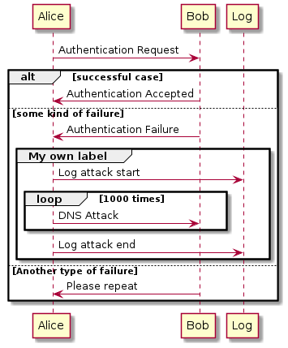

- [Preamble](#org3ca586c)
- [Versions <code>[1/1]</code>](#orgd9f9cee)
- [Diagrams](#org809be4e)
  - [PlantUML](#org5aa9b04)
    - [Setup <code>[0/6]</code>](#org23631b0)
    - [Workflow <code>[0/4]</code>](#orgaeebfc4)
    - [Sequence diagrams](#org47c9ebc)


<a id="org3ca586c"></a>

# Preamble

-   This folder contains all the information about the project.
-   It is written incrementally, i.e., as the several project phases take place, the document versions pertaining to each phase are stored in the folder **submission**.


<a id="orgd9f9cee"></a>

# Versions <code>[1/1]</code>

1.  [X] Problem statement: deadline - <span class="timestamp-wrapper"><span class="timestamp">&lt;2021-10-28 qui&gt;</span></span>


<a id="org809be4e"></a>

# Diagrams

Diagrams can be drawn using <code>[2/2]</code>:

-   [X] draw.io
    -   User mockups
    -   State-machine
-   [X] [PlantUML](#org5aa9b04) (stored in Proj/diags/plantuml)
    -   Sequence diagram
    -   Class diagram


<a id="org5aa9b04"></a>

## PlantUML

[PlantUML](https://plantuml.com/) is a tool for quickly drawing diagrams from text based descriptions. It is specially adequate for sequence diagrams, as draw.io is not very fluid.


<a id="org23631b0"></a>

### Setup <code>[0/6]</code>

1.  [ ] Download PlantUML from the [website](https://sourceforge.net/projects/plantuml/files/plantuml.jar/download): `plantuml.jar`
2.  [ ] Place the `plantuml.jar` file into a known directory and add it to the path
3.  [ ] Write a diagram text file in an extension `.pu` (example input/test.pu) - check the user manual for this
4.  [ ] Navigate to the `input` folder using cd
5.  [ ] Generate the diagram from the terminal using:
    
    ```bash
    java -jar plantuml.jar test.pu -o ../output/
    ```
6.  [ ] Check the generate png file: `output/test.png`


<a id="orgaeebfc4"></a>

### Workflow <code>[0/4]</code>

1.  [ ] Write a diagram text file in an extension `.pu` (example input/test.pu) - check the user manual for this
2.  [ ] Navigate to the `input` folder using cd
3.  [ ] Generate the diagram from the terminal using:
    
    ```bash
    java -jar plantuml.jar test.pu -o ../output/
    ```
4.  [ ] Check the generate png file: `output/test.png`


<a id="org47c9ebc"></a>

### Sequence diagrams

1.  Declaring participants

    If the keyword participant is used to declare a participant, more control on that participant is possible.
    
    The order of declaration will be the (default) order of display.
    
    Using these other keywords to declare participants will change the shape of the participant representation:
    
    1.  actor
    2.  boundary
    3.  control
    4.  entity
    5.  database
    6.  collections
    7.  queue
    
    ```plantuml
      ' title PlantUML (comment)
    @startuml
    
    participant Participant as Foo
    actor       Actor       as Foo1
    boundary    Boundary    as Foo2
    control     Control     as Foo3
    entity      Entity      as Foo4
    database    Database    as Foo5
    collections Collections as Foo6
    queue       Queue       as Foo7
    Foo -> Foo1 : To actor 
    Foo -> Foo2 : To boundary
    Foo -> Foo3 : To control
    Foo -> Foo4 : To entity
    Foo -> Foo5 : To database
    Foo -> Foo6 : To collections
    Foo -> Foo7: To queue
    
    @enduml
    ```
    
    

2.  Change arrow style

    You can change arrow style by several ways:
    
    1.  add a final x to denote a lost message
    2.  use \\ or / instead of < or > to have only the bottom or top part of the arrow
    3.  repeat the arrow head (for example, >> or //) head to have a thin drawing
    4.  use &#x2013; instead of - to have a dotted arrow
    5.  add a final "o" at arrow head
    6.  use bidirectional arrow <->
    
    ```plantuml
    @startuml
    ' comments as needed
    ' lost message
    Bob ->x Alice 
    ' sync message
    Bob -> Alice 
    ' async message
    Bob ->> Alice
    Bob -\ Alice
    Bob \\- Alice
    Bob //-- Alice
    
    Bob ->o Alice
    Bob o\\-- Alice
    
    ' bidirectional message
    Bob <-> Alice
    Bob <->o Alice
    @enduml
    ```
    
    

3.  Grouping messages

    ([src](https://plantuml.com/sequence-diagram#425ba4350c02142c))
    
    It is possible to group messages together using the following keywords:
    
    1.  alt/else
    2.  opt
    3.  loop
    4.  par
    5.  break
    6.  critical
    7.  group, followed by a text to be displayed
    
    It is possible to add a text that will be displayed into the header (for group, see next paragraph 'Secondary group label').
    
    The end keyword is used to close the group.
    
    Note that it is possible to nest groups.
    
    ```plantuml
      ' title PlantUML (comment)
    @startuml
    Alice -> Bob: Authentication Request
    
    alt successful case
    
        Bob -> Alice: Authentication Accepted
    
    else some kind of failure
    
        Bob -> Alice: Authentication Failure
        group My own label
        Alice -> Log : Log attack start
    	loop 1000 times
    	    Alice -> Bob: DNS Attack
    	end
        Alice -> Log : Log attack end
        end
    
    else Another type of failure
    
       Bob -> Alice: Please repeat
    
    end
    @enduml
    ```
    
    

4.  Notes on messages

    It is possible to put notes on message using the note left or note right keywords just after the message.
    
    You can have a multi-line note using the end note keywords.
    
    ```plantuml
    @startuml
    Alice->Bob : hello
    note left: this is a first note
    
    Bob->Alice : ok
    note right: this is another note
    
    Bob->Bob : I am thinking
    note left
    a note
    can also be defined
    on several lines
    end note
    @enduml
    ```
    
    

5.  Divider or separator

    If you want, you can split a diagram using == separator to divide your diagram into logical steps.
    
    ```plantuml
    @startuml
    
    == Initialization ==
    
    Alice -> Bob: Authentication Request
    Bob --> Alice: Authentication Response
    
    == Repetition ==
    
    Alice -> Bob: Another authentication Request
    Alice <-- Bob: another authentication Response
    
    @enduml
    ```
    
    

6.  Lifeline activation and destruction

    The `activate` and `deactivate` are used to denote participant activation.
    
    Once a participant is activated, its lifeline appears.
    
    The activate and deactivate apply on the previous message.
    
    The `destroy` denote the end of the lifeline of a participant.
    
    ```plantuml
    @startuml
    participant User
    
    User -> A: DoWork
    activate A
    
    A -> B: << createRequest >>
    activate B
    
    B -> C: DoWork
    activate C
    C --> B: WorkDone
    destroy C
    
    B --> A: RequestCreated
    deactivate B
    
    A -> User: Done
    deactivate A
    
    @enduml
    ```
    
    

7.  Participant creation

    You can use the `create` keyword just before the first reception of a message to emphasize the fact that this message is actually creating this new object.
    
    ```plantuml
    @startuml
    Bob -> Alice : hello
    
    create Other
    Alice -> Other : new
    
    create control String
    Alice -> String
    note right : You can also put notes!
    
    Alice --> Bob : ok
    
    @enduml
    ```
    
    

8.  Incoming and outgoing messages

    You can use incoming or outgoing arrows if you want to focus on a part of the diagram.
    
    Use square brackets to denote the left "[" or the right "]" side of the diagram.
    
    ```plantuml
    @startuml
    [-> A: DoWork
    
    activate A
    
    A -> A: Internal call
    activate A
    
    A ->] : << createRequest >>
    
    A<--] : RequestCreated
    deactivate A
    [<- A: Done
    deactivate A
    @enduml
    ```
    
    

9.  Anchors and duration

    With `teoz` it is possible to add anchors to the diagram and use the anchors to specify duration time.
    
    ```plantuml
    @startuml
    !pragma teoz true
    
    {start} Alice -> Bob : start doing things during duration
    Bob -> Max : something
    Max -> Bob : something else
    {end} Bob -> Alice : finish
    
    {start} <-> {end} : some time
    
    @enduml
    ```
    
    
    
    You can use the -Pcommand-line option to specify the pragma:
    
    ```bash
    java -jar plantuml.jar -Pteoz=true
    ```

10. Participants encompass

    It is possible to draw a box around some participants, using box and end box commands.
    
    You can add an optional title or a optional background color, after the box keyword.
    
    ```plantuml
    @startuml
    
    box "Internal Service" #LightBlue
    participant Bob
    participant Alice
    end box
    participant Other
    
    Bob -> Alice : hello
    Alice -> Other : hello
    
    @enduml
    ```
    
    

11. Remove foot boxes

    You can use the `hide footbox` keywords to remove the foot boxes of the diagram.
    
    ```plantuml
    @startuml
    
    hide footbox
    title Foot Box removed
    
    Alice -> Bob: Authentication Request
    Bob --> Alice: Authentication Response
    
    @enduml
    ```
    
    

12. Style `strictuml`

    To be conform to strict UML (for arrow style: emits triangle rather than sharp arrowheads), you can use:
    
    ```plantuml
    @startuml
    skinparam style strictuml
    Bob -> Alice : hello
    Alice -> Bob : ok
    @enduml
    ```
    
    

13. Color a group message

    It is possible to color a group message:
    
    ```plantuml
    @startuml
    Alice -> Bob: Authentication Request
    alt#Gold #LightBlue Successful case
        Bob -> Alice: Authentication Accepted
    else #Pink Failure
        Bob -> Alice: Authentication Rejected
    end
    @enduml
    ```
    
    

14. Colors

    You can use specify **fill** and **line** colors either:
    
    1.  with its standard name or CSS name
    2.  using HEX value (6 digits): #RRGGBB
    3.  using HEX value (8 digits) with alpha compositing or RGBA color model: \#RRGGBBaa
    4.  using short HEX value (3 digits): #RGB
    
    ```plantuml
    @startuml
    actor Bob #Red/Yellow
    actor Alice #FF0000/FFFF00
    Alice -> Bob : hello
    @enduml
    ```
    
    
