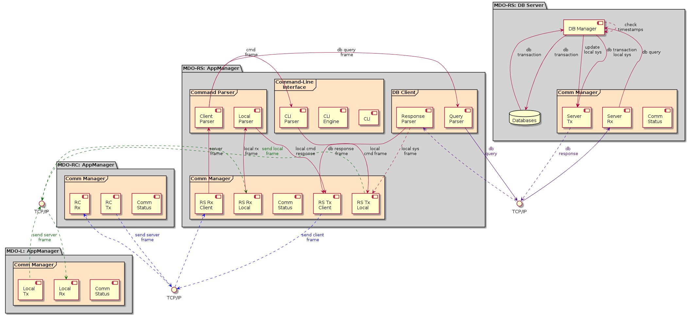
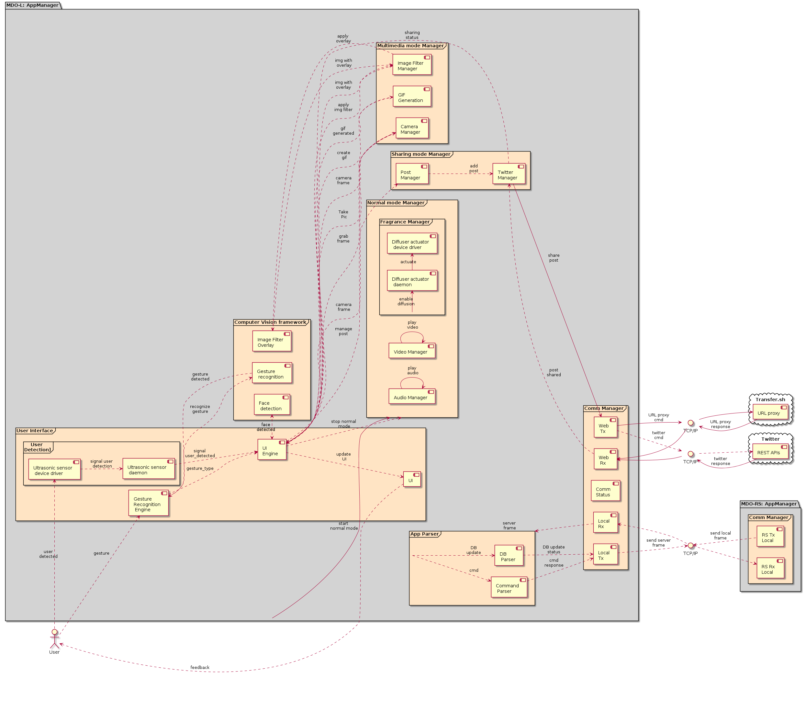
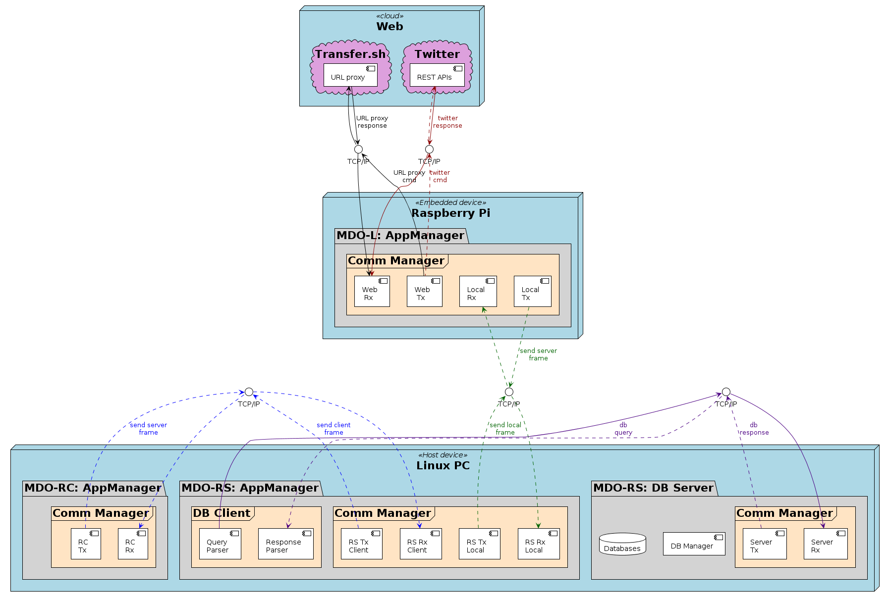
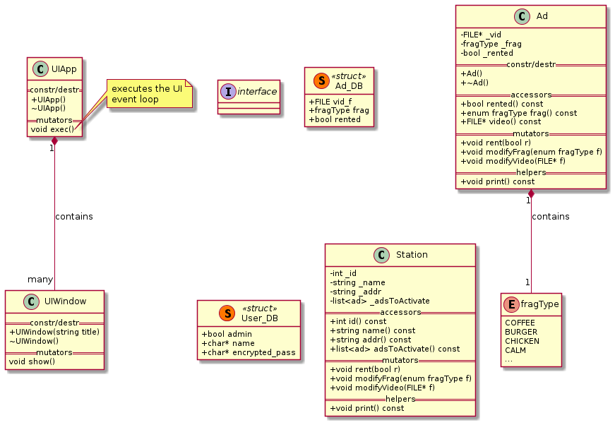
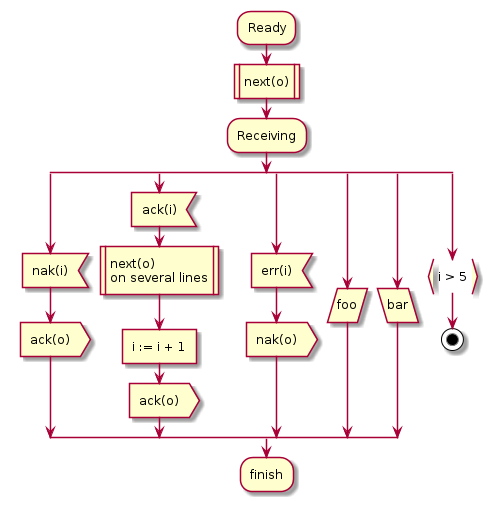

- [Preamble](#org46d99ca)
- [Versions <code>[4/4]</code>](#org95dbcdd)
- [Notes](#org47407e5)
  - [Requirements](#org94b9eed)
  - [Problem statement](#org0aa374d)
  - [Research](#orgc76445e)
    - [Topics <code>[0/3]</code>](#org83d0041)
    - [Selection](#org05fb3df)
  - [Report](#orgd1574d9)
    - [Outline <code>[2/8]</code>](#orgdfb150c)
  - [Marketing Digital Outdoor](#org95408f6)
    - [Topics](#org408a762)
    - [Technologies <code>[0/11]</code>](#org7d22f9d)
    - [Problem statement](#org6017478)
    - [Market research <code>[3/3]</code>](#org2c2daa1)
    - [Project planning](#orgacc1afd)
    - [Analysis](#org8fa47b0)
    - [Theoretical foundations <code>[17/17]</code>](#org12569ed)
    - [Design](#org5b72c1e)
    - [Implementation <code>[0/3]</code>](#orgf5bacb0)
- [Diagrams](#orgd707018)
  - [PlantUML](#org7a0e981)
    - [Setup <code>[0/6]</code>](#orge7076e7)
    - [Workflow <code>[0/4]</code>](#orgca0f764)
    - [Sequence diagrams](#org5116acd)
    - [Component diagrams](#org9d0b870)
    - [Deployment diagrams](#org7639b94)
    - [Class diagrams](#org57b2260)
    - [Entity-Relationship diagram](#orgf063022)
    - [Flowcharts (activity diagram)](#orgba24751)
    - [Data formats](#org81dc48c)
- [RDBMS](#org8f3054b)
  - [SQLite vs MySQL](#org15f8bee)
  - [mySQL](#org057edb9)
    - [Installation <code>[1/1]</code>](#orgecf5869)
    - [Server](#org22bbff6)
    - [Shell](#org0820361)
    - [C++ connector](#orgb03b9b9)
- [GIF generation](#orgf11625f)
  - [C++ libraries and APIs <code>[0/1]</code>](#org7c18a9b)
- [CMake](#orgb1fb75f)
- [OpenCV](#org29dbd2d)
  - [Build and integrate with Qt5](#org49e2dec)
    - [Build opencv <code>[7/7]</code>](#orgcaca277)
    - [Compile a simple standlone project](#org5f7090e)
    - [Integrate with Qt <code>[2/2]</code>](#org29c1846)
    - [Read, display and process videos with Qt and OpenCV](#orgee7da8c)
- [Twitter sharing](#orgeffb95a)
  - [Account](#org56d0c47)
  - [Access to Twitter API](#orgc3d152f)
  - [Example program](#orge99e1db)


<a id="org46d99ca"></a>

# Preamble

-   This folder contains all the information about the project.
-   It is written incrementally, i.e., as the several project phases take place, the document versions pertaining to each phase are stored in the folder **submission**.


<a id="org95dbcdd"></a>

# Versions <code>[4/4]</code>

1.  [X] Problem statement: deadline - <span class="timestamp-wrapper"><span class="timestamp">&lt;2021-10-28 qui&gt;</span></span>
2.  [X] Phase 1
3.  [X] Analysis phase: deadline
4.  [X] Design phase: <span class="timestamp-wrapper"><span class="timestamp">&lt;2021-12-15 qua 23:00&gt;</span></span>


<a id="org47407e5"></a>

# Notes     :Important:


<a id="org94b9eed"></a>

## Requirements

-   buildroot
-   c/c++ (both)
-   Device drivers
-   Linux/Raspberry Pi
-   CPS: Cyber-physical systems
-   Makefiles


<a id="org0aa374d"></a>

## Problem statement

Think about the project and deliver a document about it.


<a id="orgc76445e"></a>

## Research


<a id="org83d0041"></a>

### Topics <code>[0/3]</code>

-   [ ] Cyber-physical systems characteristics: <span class="underline">identify the required features for the system</span>
-   [ ] Analyze previous projects to understand what is feasible in terms of Real-time systems using device drivers with Raspberry Pi: <span class="underline">gives an overall idea of what can be achieved</span>
-   [ ] Situate the project requirements, the project constraints


<a id="org05fb3df"></a>

### Selection

-   [Marketing digital Outdoor](readme.md)


<a id="orgd1574d9"></a>

## Report


<a id="orgdfb150c"></a>

### Outline <code>[2/8]</code>

1.  [X] Introduction
    1.  Motivation and context
    2.  Problem statement
    3.  Market research
    4.  Goals
    5.  Project planning
    6.  Report outline
2.  [X] Analysis
    1.  Background and state of the art
    2.  Requirements and constraints
    3.  System overview
    4.  System architecture
        1.  HW architecture
        2.  SW architecture
    5.  Subsystems decomposition
        1.  Events
        2.  Use cases
        3.  State machine diagram
        4.  Sequence diagram
    6.  Budget
3.  [ ] Theoretical foundations
4.  [ ] Design
    1.  HW specification
        1.  Block diagram with COTS components, if possible
        2.  List of constraints of functions to be implemented in HW or SW
    2.  HW interfaces definition
        1.  I/O ports
        2.  HW registers
        3.  Memory addresses for shared or I/O by memory mapping
        4.  HW interrupts
    3.  SW specification
        1.  Identify main subsystems
        2.  System tasks
    4.  SW interfaces definition
        -   Define the APIs in detail:
            -   header files with:
                -   functions prototypes
                -   data structure declarations
                -   class declarations
    5.  Start-up/shutdown process specification
    6.  Error Handling specification
5.  [ ] Implementation
6.  [ ] Testing
7.  [ ] Verification/Validation
8.  [ ] Conclusions


<a id="org95408f6"></a>

## Marketing Digital Outdoor     :Important:


<a id="org408a762"></a>

### Topics

1.  Motivation and context
    -   Scenting marketing is a great approach to draw people into stores.
    -   Scent sense is the fastest way to the brain, thus, providing an exceptional opportunity for marketing.
    -   Combining that with additional stimuli, like eye and earing, can significantly boost the marketing outcome.
        
        > -   Knowing your target audience it is critical for the success of stores.
        > -   Marketing can be used to collect, analyse, investigate and decide the best politics for addressing a specific target audience, understanding the its behavioral patterns.
        > -   To understand behavioral patterns <span class="underline">machine-learning models</span> can be used.
2.  Concept
    -   Offer a marketing digital outdoor for brands to advertise and captivate customers
    -   Brands can buy advertisement space and time by sending the following data:
        
        |                         |               |           |          |              |      |
        |------------------------ |-------------- |---------- |--------- |------------- |----- |
        | Digital Outdoor location | Fragrance name | Start Time | Stop Time | Audio Message | Video |
        
        -   The brands can send the data to our company database through our website/application.
        -   The data will then be sent to the marketing digital outdoor using a wireless communication technology.
    -   The advertisement data will be exposed into a display, an audio message transmitted, as well as the indicate fragrance between the designated time interval.
    -   COVID pandemics changed the perspectives about user interaction with the surroundings, with non touch interfaces being preferred. Thus, a non touch user interface is a must have.
    -   When a user approaches the marketing digital outdoor, a proximity sensor will detect it and activate the <span class="underline">user interaction mode</span>.
        -   When activating this mode the camera is started mirroring the user into the display and providing additional options.
        -   In this mode, the user can:
            1.  apply image filters related to the brand
            2.  take pics
            3.  create GIFs
            4.  share them
        -   This mode requires:
            -   Facial detection for image filter application
            -   Hand gesture recognition for navigating the menus and activating options
            -   A virtual keyboard (non-touch) will be provided for user input, by mapping the screen to the keys and waiting for a designated time before accepting it.
            -   A set of hand gestures to be used in user interaction
        -   Several sharing platforms shall be provided namely social media and email.
            -   Tracking the nr of shares provides feedback for the brands in respect of the brand awareness.
            -   Additionally, brands can also monitor this by checking their social media accounts.


<a id="org7d22f9d"></a>

### Technologies <code>[0/11]</code>

1.  [ ] Computer vision for facial and gesture recognition (OpenCV)
2.  [ ] Database for marketing digital outdoor management (SQL)
3.  [ ] Website/Application for brands communication to our database
4.  [ ] Wireless communication technology for remote communication with digital outdoors
5.  [ ] Image filter application
6.  [ ] Infrared detection
7.  [ ] Camera recording
8.  [ ] Audio output
9.  [ ] Nebulizer technology for scenting
10. [ ] Screen mapping to keys for virtual keyboard
11. [ ] Social media and e-mail sharing APIs


<a id="org6017478"></a>

### ✔ DONE Problem statement


<a id="org2c2daa1"></a>

### ✔ DONE Market research <code>[3/3]</code>

1.  [X] Scenting marketing: trends, market value
2.  [X] Digital Outdoors: quantity, market value
3.  [X] Combined marketing: are they digital outdoor + scenting?


<a id="orgacc1afd"></a>

### Project planning

1.  Gantt diagram <code>[0/8]</code>

    1.  [ ] Planning
        -   [ ] Kick-off meeting
        -   [ ] Problem Statement
        -   [ ] Market Research
        -   [ ] Project Planning
    2.  [ ] Analysis
        -   [ ] System overview
        -   [ ] Requirements and constraints
        -   [ ] System architecture
        -   [ ] System Analysis
        -   [ ] Estimated budgets
        -   [ ] Subsystem decomposition
            -   [ ] Events
            -   [ ] Use-cases
            -   [ ] Dynamic operation: state-machine diagram
            -   [ ] Flow of events: sequence diagram
    3.  [ ] Design
        -   [ ] Analysis review
        -   [ ] HW specification
        -   [ ] Component shipping
        -   [ ] Software specification
            -   [ ] Remote client
            -   [ ] Remote server + database
            -   [ ] Local system
    4.  [ ] Implementation
        -   [ ] HW testing
        -   [ ] SW implementation
            -   [ ] Remote client
            -   [ ] Remote server + database
            -   [ ] Local system
        -   [ ] HW implementation
            -   [ ] Breadboard
            -   [ ] PCB design
        -   [ ] System configuration
    5.  [ ] Testing
        1.  [ ] SW unit testing
        2.  [ ] SW integrated testing
        3.  [ ] HW unit testing
        4.  [ ] HW integrated testing
        5.  [ ] Functional testing
    6.  [ ] Verification/Validation
        1.  [ ] Verification
        2.  [ ] Validation
    7.  [ ] Report Writing
        1.  [ ] Problem statement
        2.  [ ] Analysis
        3.  [ ] Design
        4.  [ ] Implementation
        5.  [ ] Final
    8.  [ ] Documentation
        1.  [ ] Problem statement
        2.  [ ] Analysis
        3.  [ ] Design
        4.  [ ] Implementation
        5.  [ ] Testing

2.  Required HW <code>[3/7]</code>

    Research link: <https://www.one-tab.com/page/TZxmVAXJTO6nVyNO593ARA>
    
    -   [X] Raspberry Pi 4: 52 EUR
    -   [X] HDMI screen: 50 EUR - <https://shorturl.at/oyAOR>
    -   [ ] Relay/Transistor + Ultrassonic actuator for nebulizing fragrance
    -   [ ] Audio output
    -   [ ] Power supply
    -   [ ] Mechanical structure
    -   [X] Camera: 14 EUR - <https://shorturl.at/gnpCU>


<a id="org8fa47b0"></a>

### ✔ DONE Analysis

1.  System architecture

    **Example**
    
    > BRAND -> DB RC -> RS: q brand Nestle RS -> DB: query brand Nestle DS -> RS: Nestle milka.mp4 milka.wav Chocolate RS -> RC: Nestle milka.mp4 milka.wav Chocolate
    > 
    > COMPANY -> MDO-L Staff member login RC -> RS: q mdo systems RS -> DB: query mdo-systems DB -> RS: std::<vector> mdo<sub>systems</sub> for(i = 0; i < mdo<sub>systems.size</sub>(); i++ ) RS -> RC: mdo<sub>systems</sub>[i] RC -> RC: Select MDO-L machine Send command RC -> RS: mdo <nr> <command> (mdo 1 get mode) RS -> RS: parse command RS -> RS: get mdo<sub>nr</sub> IP (query mdo-systems 1 IP) RS -> MDO-L: connect IP:port MDO-L -> RS: connected RS -> MDO-L: get mode MDO-L -> RS: normal mode (example) RS -> RC: normal


<a id="org12569ed"></a>

### ✔ DONE Theoretical foundations <code>[17/17]</code>

1.  [X] **Project methodology: Waterfall model**
2.  [X] **Multitasking and Pthreads**
3.  [X] **Client-Server architecture & TCP/IP & OSI model**
4.  [X] *Daemons*
5.  [X] *Device drivers*
6.  [X] **Nebulizer technology for scenting**
7.  [X] **Computer Vision**
    1.  [X] **OpenCV**
    2.  [X] **Gesture recognition algorithms**
    3.  [X] **Face detection algorithms**
        1.  see [openCV3 book](biblio/OpenCV3_Computer-Vision-in-C++-with-the-OpenCV-Library.pdf) (pg. 883)
8.  [X] **RDBMS (Relational Database management system) (SQL)**
9.  [X] *User detection technologies: IR, ultrasonic*
10. [X] *Camera recording and codecs*
11. [X] *Image filtering APIs*
12. [X] *GIFs generation*
13. [X] **Social media and e-mail sharing APIs**
14. [X] *UI framework: Qt*
15. [X] *File transfer protocols*
16. [X] **Makefiles**
17. [X] **Source code documentation**: Doxygen

Legend:

-   **Ze**
-   *Hugo*


<a id="org5b72c1e"></a>

### ▭▭ IN-PROGRESS Design

Next Thursday, December 16th, we will have the presentations for the Design Phase. Submit the **presentation** and **report** until Wednesday 15th, 23:00h.

Design Phase must include (some specifications may vary according to your project):

1.  **Hardware Specification** <code>[6/6]</code>:
    -   [X] Architecture
        -   In the analysis phase an overview of the HW architecture was conceptualized. In this section, a more specific HW architecture is illustrated, using a block-diagram.
        -   BLOCK DIAGRAM and comment it
    -   [X] Hardware Component Specification <code>[8/8]</code>
        1.  [X] Raspberry Pi
            1.  SD card
        2.  [X] Power supply module
        3.  [X] Ultrasonic sensor
        4.  [X] Fragrance diffuser actuator: <https://shorturl.at/hlxFQ>
        5.  [X] LCD display: <https://shorturl.at/dnoIZ>
        6.  [X] Raspberry Pi Camera
        7.  [X] Colunas
        8.  [X] On/off button
    -   [X] Peripherals Pinout/Mapping/Connection Layout
        -   Draw a schematic for connecting all HW components
        -   Add a table containing:
            
            |            | PIN MAPPING      |          |
            | Controller | Interface device | Function |
    -   [X] Test Cases
        -   **Ultrasonic sensor**: one will connect the ultrasonic sensor to Raspberry Pi. Then an object will be approximated to the sensor from several distances with the corresponding distance being measure with a measuring tape. If the distance measured by the sensor and the measuring device are within the error margin provided by the manufactured, the device is compliant.
            
            |        |             |            |                |
            |------- |------------ |----------- |--------------- |
            | HW item | Type of test | Description | Expected result |
    -   [X] PCB layout (when applicable)
        -   Custom PCB for ultrasonic sensors + fragrance diffuser actuator
    -   [X] Tools
        -   PADS, KiCad
2.  **Software Specification** <code>[11/11]</code>:
    -   [X] Entity Relations Diagram
    -   [X] Classes Diagram
        -   [X] Remote Client
        -   [X] Remote Server
        -   [X] Local System
    -   [X] Data Formats
    -   [X] Flowcharts
    -   [X] Tasks Division (accurate plan)
    -   [X] Thread Priorities
    -   [X] GUI Layouts
    -   [X] Test Cases
    -   [X] Software COTs
    -   [X] Third-party Libraries/apps
    -   [X] Tools

It is compulsory to show/identify which/where all class topics are going to be implemented and used by you! Also third-party Libraries/apps must be identified so you can use other's software and materials with our consent.


<a id="orgf5bacb0"></a>

### Implementation <code>[0/3]</code>

1.  [ ] Remote Client
2.  [ ] Remote Server
3.  [ ] Local System

1.  Remote Client <code>[0/3]</code>

    1.  [ ] **UI**
        1.  [ ] Design the UI, populating with items, by phases:
            1.  Initial view: Login + Register
            2.  Main view: only if Login was successful
    2.  [ ] **Sockets & Client/Server Arch**
        1.  [ ] Connect
        2.  [ ] Send
        3.  [ ] Recv
    3.  [ ] *Implement classes as needed*
        1.  [ ] User
        2.  [ ] Admin
        3.  [ ] Station
        4.  [ ] Timetable
        5.  [ ] Ad
    
    <span class="underline">Legend</span>:
    
    -   **Top priority**
    -   *Medium priority*
    -   `Low priority`

2.  Remote Server <code>[0/6]</code>

    1.  [ ] **MySQL (DB Server)**
        1.  [ ] Create tables
        2.  [ ] Run some tests
    2.  [ ] DB
        1.  [ ] **handleQuery**
        2.  [ ] *UpdateLocalSys*
        3.  [ ] `handleCmd`
    3.  [ ] **Sockets & Client/Server Arch**
        1.  [ ] Accept connection
        2.  [ ] Recv
        3.  [ ] Send
    4.  [ ] **Parser**
    5.  [ ] *File Transfer*
    6.  [ ] `CLI`
    
    <span class="underline">Legend</span>:
    
    -   **Top priority**
    -   *Medium priority*
    -   `Low priority`

3.  Local System <code>[0/2]</code>

    1.  [ ] `HW` <code>[0/3]</code>
        1.  [ ] Tests <code>[0/6]</code>:
            1.  [ ] Power Supply
            2.  [ ] LCD Display
            3.  [ ] Speakers
            4.  [ ] Fragrance diffuser
            5.  [ ] Camera
            6.  [ ] Ultrasonic sensor
        2.  [ ] Mechanical design
        3.  [ ] PCB manufacturing
    2.  [ ] SW: implementation <code>[0/2]</code>
        1.  [ ] Linux & Raspbian tests <code>[0/8]</code>
            1.  [ ] **UI**
                1.  [ ] Design the UI, populating with items, by phases:
                    1.  Initial view: Login + Register
                    2.  Main view: only if Login was successful
            2.  [ ] **Sockets & Client/Server Arch** <code>[0/3]</code>
                1.  [ ] Connect
                2.  [ ] Send
                3.  [ ] Recv
            3.  [ ] **Computer Vision** <code>[0/4]</code>
                1.  [ ] **Frame grabbing**
                2.  [ ] **Face detection**
                3.  [ ] **Gesture recognition**
                    1.  [ ] Determine set of gestures required
                    2.  [ ] Create database of gestures
                4.  [ ] *Image filter overlay*
            4.  [ ] *Normal mode* <code>[0/3]</code>
                1.  [ ] **Video reproduction**
                2.  [ ] **Audio reproduction**
                3.  [ ] *Fragrance diffusion* <code>[0/2]</code>
                    1.  [ ] Device driver
                    2.  [ ] Daemon
            5.  [ ] *User detection*
                1.  [ ] *Device driver*
                2.  [ ] *Daemon*
            6.  [ ] *Twitter sharing*
                1.  [ ] Create post
                2.  [ ] Share
                3.  [ ] Handle response
            7.  [ ] `GIF generator`
            8.  [ ] `File transfer`
        2.  [ ] Raspberry Pi deployment <code>[0/3]</code>
            1.  [ ] Buildroot customization
            2.  [ ] Startup/Shutdown sequence
            3.  [ ] System verification
    
    <span class="underline">Legend</span>:
    
    -   **Top priority**
    -   *Medium priority*
    -   `Low priority`

4.  Collaborative work

    1.  Folder struct
    
        -   code <code>[0/3]</code>
            -   [ ] RC
                -   [ ] src
                -   [ ] inc
                -   [ ] obj
                -   [ ] bin
                -   [ ] doc
                -   [ ] ver
            -   [ ] RS
                -   [ ] src
                -   [ ] inc
                -   [ ] obj
                -   [ ] bin
                -   [ ] doc
                -   [ ] ver
            -   [ ] LS
                -   [ ] src
                -   [ ] inc
                -   [ ] obj
                -   [ ] bin
                -   [ ] doc
                -   [ ] ver
    
    2.  Git workflow
    
        1.  Create separate branches
            1.  Example
                1.  Main: stable
                2.  Developer: ongoing work
                3.  Feature: implement specific feature
            2.  ToDo
                1.  Main: stable
                2.  Hugo: RC + RS
                    1.  Login: implement specific feature
                3.  Ze: Local
    
    3.  Documentation
    
        1.  Doxygen
            1.  Add snippets
            2.  Scope of doc
                
                1.  **block**: used to describe classes, functions, structures, and enumerations.
                    
                    ```c
                    /**
                     * allocate dynamic memory and initialze App
                     * @return initialized App_T
                     */
                    App_T App_init();
                    ```
                    
                    1.  **Public**: public interfaces are documented in the interface file (`.h`)
                        
                        ```c
                        /**
                         * allocate dynamic memory and initialze App
                         * @return initialized App_T
                         */
                        App_T App_init();
                        ```
                    2.  **Private**: private interfaces are documented in the implementation file (`.c`)
                        
                        ```c
                        /**
                         * @brief Saves the database
                         * @param db: a constructed database
                         * @param list: a constructed list to save
                         * @param serialize: pointer to generic function capable of serializing 
                         * the specific data of the database
                         * @param print: pointer to generic function to debug info
                         * @return true, if successfull; false otherwise
                         *
                         * Used to save users, activities and packs to the database.
                         * *serialize* functions must be implemented by clients.
                         * *print* functions must be implemented by clients.
                         * @see User.h
                         * @see Activity.h
                         * @see Pack.h
                         */
                        static bool App_save_database(Database_T db, List_T list, 
                        			      void * (*serialize)(Fifo_T fifo),
                        			      void(*print)(void *data))
                        {
                            void *data;
                            if(List_isDirty(list)) {
                        	/* Reopen database and rewind list */
                        	Database_close(db);
                        	Database_open(db, "wb");
                        	List_rewind(list);
                        	/* While an user exists */
                        	while ( (data = List_pop(list)) != NULL ) {
                        	    /* Serialize object to file and remove from the list */
                        	    App_serialize(db, serialize, data);
                        	    List_remove(&list, data);
                        	    List_rewind(list);
                        	    if(print) {
                        		print(data);
                        		print_msg_wait("Wait\n", -1); 
                        	    }
                        	}
                        	return true;
                        
                            }
                            return false;
                        
                        }
                        ```
                2.  **file**: used to describe modules or classes.
                    
                    ```c
                    /**
                     * @file App.h
                     * @author Jose Pires
                     * @date 12 Jan 2019
                     *
                     * @brief App module containing the application logic
                     *
                     * It contains only two public functions:
                     * 1. Init - to initialize the app's memory
                     * 2. Exec - contains all application logic
                     */
                    ```
                3.  **inline**: used to describe `#defines`, parameters, class members, and
                
                structure and enumeration fields.
                
                ```c
                #define DATABASE_USERS "user.db" /**< Database file for users */
                ```


<a id="orgd707018"></a>

# Diagrams

Diagrams can be drawn using <code>[2/2]</code>:

-   [X] draw.io
    -   User mockups
    -   State-machine
-   [X] [PlantUML](#org7a0e981) (stored in Proj/diags/plantuml)
    -   Sequence diagram
    -   Class diagram
    -   Component diagram
    -   Deployment diag
    -   Entity-Relationship diagram


<a id="org7a0e981"></a>

## PlantUML

[PlantUML](https://plantuml.com/) is a tool for quickly drawing diagrams from text based descriptions. It is specially adequate for sequence diagrams, as draw.io is not very fluid.


<a id="orge7076e7"></a>

### Setup <code>[0/6]</code>

1.  [ ] Download PlantUML from the [website](https://sourceforge.net/projects/plantuml/files/plantuml.jar/download): `plantuml.jar`
2.  [ ] Place the `plantuml.jar` file into a known directory and add it to the path
3.  [ ] Write a diagram text file in an extension `.pu` (example input/test.pu) - check the user manual for this
4.  [ ] Navigate to the `input` folder using cd
5.  [ ] Generate the diagram from the terminal using:
    
    ```bash
    java -jar plantuml.jar test.pu -o ../out java -jar plantuml.jar test.puput/
    ```
6.  [ ] Check the generate png file: `output/test.png`


<a id="orgca0f764"></a>

### Workflow <code>[0/4]</code>

1.  [ ] Write a diagram text file in an extension `.pu` (example input/test.pu) - check the user manual for this
2.  [ ] Navigate to the `input` folder using cd
3.  [ ] Generate the diagram from the terminal using:
    
    ```bash
    java -jar plantuml.jar test.pu -o ../output/
    ```
4.  [ ] Check the generate png file: `output/test.png`


<a id="org5116acd"></a>

### ✔ DONE Sequence diagrams

1.  Declaring participants

    If the keyword participant is used to declare a participant, more control on that participant is possible.
    
    The order of declaration will be the (default) order of display.
    
    Using these other keywords to declare participants will change the shape of the participant representation:
    
    1.  actor
    2.  boundary
    3.  control
    4.  entity
    5.  database
    6.  collections
    7.  queue
    
    ```plantuml
      ' title PlantUML (comment)
    @startuml
    
    participant Participant as Foo
    actor       Actor       as Foo1
    boundary    Boundary    as Foo2
    control     Control     as Foo3
    entity      Entity      as Foo4
    database    Database    as Foo5
    collections Collections as Foo6
    queue       Queue       as Foo7
    Foo -> Foo1 : To actor 
    Foo -> Foo2 : To boundary
    Foo -> Foo3 : To control
    Foo -> Foo4 : To entity
    Foo -> Foo5 : To database
    Foo -> Foo6 : To collections
    Foo -> Foo7: To queue
    
    @enduml
    ```
    
    

2.  Change arrow style

    You can change arrow style by several ways:
    
    1.  add a final x to denote a lost message
    2.  use \\ or / instead of < or > to have only the bottom or top part of the arrow
    3.  repeat the arrow head (for example, >> or //) head to have a thin drawing
    4.  use &#x2013; instead of - to have a dotted arrow
    5.  add a final "o" at arrow head
    6.  use bidirectional arrow <->
    
    ```plantuml
    @startuml
    ' comments as needed
    ' lost message
    Bob ->x Alice 
    ' sync message
    Bob -> Alice 
    ' async message
    Bob ->> Alice
    Bob -\ Alice
    Bob \\- Alice
    Bob //-- Alice
    
    Bob ->o Alice
    Bob o\\-- Alice
    
    ' bidirectional message
    Bob <-> Alice
    Bob <->o Alice
    @enduml
    ```
    
    

3.  Grouping messages

    ([src](https://plantuml.com/sequence-diagram#425ba4350c02142c))
    
    It is possible to group messages together using the following keywords:
    
    1.  alt/else
    2.  opt
    3.  loop
    4.  par
    5.  break
    6.  critical
    7.  group, followed by a text to be displayed
    
    It is possible to add a text that will be displayed into the header (for group, see next paragraph 'Secondary group label').
    
    The end keyword is used to close the group.
    
    Note that it is possible to nest groups.
    
    ```plantuml
      ' title PlantUML (comment)
    @startuml
    Alice -> Bob: Authentication Request
    
    alt successful case
    
        Bob -> Alice: Authentication Accepted
    
    else some kind of failure
    
        Bob -> Alice: Authentication Failure
        group My own label
        Alice -> Log : Log attack start
    	loop 1000 times
    	    Alice -> Bob: DNS Attack
    	end
        Alice -> Log : Log attack end
        end
    
    else Another type of failure
    
       Bob -> Alice: Please repeat
    
    end
    @enduml
    ```
    
    

4.  Notes on messages

    It is possible to put notes on message using the note left or note right keywords just after the message.
    
    You can have a multi-line note using the end note keywords.
    
    ```plantuml
    @startuml
    Alice->Bob : hello
    note left: this is a first note
    
    Bob->Alice : ok
    note right: this is another note
    
    Bob->Bob : I am thinking
    note left
    a note
    can also be defined
    on several lines
    end note
    @enduml
    ```
    
    

5.  Divider or separator

    If you want, you can split a diagram using == separator to divide your diagram into logical steps.
    
    ```plantuml
    @startuml
    
    == Initialization ==
    
    Alice -> Bob: Authentication Request
    Bob --> Alice: Authentication Response
    
    == Repetition ==
    
    Alice -> Bob: Another authentication Request
    Alice <-- Bob: another authentication Response
    
    @enduml
    ```
    
    

6.  Lifeline activation and destruction

    The `activate` and `deactivate` are used to denote participant activation.
    
    Once a participant is activated, its lifeline appears.
    
    The activate and deactivate apply on the previous message.
    
    The `destroy` denote the end of the lifeline of a participant.
    
    ```plantuml
    @startuml
    participant User
    
    User -> A: DoWork
    activate A
    
    A -> B: << createRequest >>
    activate B
    
    B -> C: DoWork
    activate C
    C --> B: WorkDone
    destroy C
    
    B --> A: RequestCreated
    deactivate B
    
    A -> User: Done
    deactivate A
    
    @enduml
    ```
    
    

7.  Participant creation

    You can use the `create` keyword just before the first reception of a message to emphasize the fact that this message is actually creating this new object.
    
    ```plantuml
    @startuml
    Bob -> Alice : hello
    
    create Other
    Alice -> Other : new
    
    create control String
    Alice -> String
    note right : You can also put notes!
    
    Alice --> Bob : ok
    
    @enduml
    ```
    
    

8.  Incoming and outgoing messages

    You can use incoming or outgoing arrows if you want to focus on a part of the diagram.
    
    Use square brackets to denote the left "[" or the right "]" side of the diagram.
    
    ```plantuml
    @startuml
    [-> A: DoWork
    
    activate A
    
    A -> A: Internal call
    activate A
    
    A ->] : << createRequest >>
    
    A<--] : RequestCreated
    deactivate A
    [<- A: Done
    deactivate A
    @enduml
    ```
    
    

9.  Anchors and duration

    With `teoz` it is possible to add anchors to the diagram and use the anchors to specify duration time.
    
    ```plantuml
    @startuml
    !pragma teoz true
    
    {start} Alice -> Bob : start doing things during duration
    Bob -> Max : something
    Max -> Bob : something else
    {end} Bob -> Alice : finish
    
    {start} <-> {end} : some time
    
    @enduml
    ```
    
    
    
    You can use the -Pcommand-line option to specify the pragma:
    
    ```bash
    java -jar plantuml.jar -Pteoz=true
    ```

10. Participants encompass

    It is possible to draw a box around some participants, using box and end box commands.
    
    You can add an optional title or a optional background color, after the box keyword.
    
    ```plantuml
    @startuml
    
    box "Internal Service" #LightBlue
    participant Bob
    participant Alice
    end box
    participant Other
    
    Bob -> Alice : hello
    Alice -> Other : hello
    
    @enduml
    ```
    
    

11. Remove foot boxes

    You can use the `hide footbox` keywords to remove the foot boxes of the diagram.
    
    ```plantuml
    @startuml
    
    hide footbox
    title Foot Box removed
    
    Alice -> Bob: Authentication Request
    Bob --> Alice: Authentication Response
    
    @enduml
    ```
    
    

12. Style `strictuml`

    To be conform to strict UML (for arrow style: emits triangle rather than sharp arrowheads), you can use:
    
    ```plantuml
    @startuml
    skinparam style strictuml
    Bob -> Alice : hello
    Alice -> Bob : ok
    @enduml
    ```
    
    

13. Color a group message

    It is possible to color a group message:
    
    ```plantuml
    @startuml
    Alice -> Bob: Authentication Request
    alt#Gold #LightBlue Successful case
        Bob -> Alice: Authentication Accepted
    else #Pink Failure
        Bob -> Alice: Authentication Rejected
    end
    @enduml
    ```
    
    

14. Colors

    You can use specify **fill** and **line** colors either:
    
    1.  with its standard name or CSS name
    2.  using HEX value (6 digits): #RRGGBB
    3.  using HEX value (8 digits) with alpha compositing or RGBA color model: \#RRGGBBaa
    4.  using short HEX value (3 digits): #RGB
    
    ```plantuml
    @startuml
    actor Bob #Red/Yellow
    actor Alice #FF0000/FFFF00
    Alice -> Bob : hello
    @enduml
    ```
    
    

15. All together     :Important:

    This example tries to combine all the most important tips stated previously.
    
    ```plantuml
    @startuml
    ' ---------- SETUP ----------------
    ' strict uml style and hide footboxes
    skinparam style strictuml
    hide footbox
    ' for anchors and duration this may be required (uncomment)
    ' !pragma teoz true
    
    
    ' ---------- Declaring participants
    participant Participant as Foo
    actor       Actor       as Foo1
    boundary    Boundary    as Foo2
    control     Control     as Foo3
    entity      Entity      as Foo4
    database    Database    as Foo5
    collections Collections as Foo6
    queue       Queue       as Foo7
    Foo -> Foo1 : To actor 
    Foo -> Foo2 : To boundary
    Foo -> Foo3 : To control
    Foo -> Foo4 : To entity
    Foo -> Foo5 : To database
    Foo -> Foo6 : To collections
    Foo -> Foo7: To queue
    
    ' -------- Grouping messages ------------------
    ' divider or separator
    ' Encompass actors
    ' add colors to cases
    ' add notes
    == Initialization ==
    
    box "Internal Service" #LightBlue
    participant Bob
    participant Alice
    end box
    Alice -> Bob: Authentication Request
    alt#Gold #LightBlue Successful case
        Bob -> Alice: Authentication Accepted
        note left: this is a first note
    else #Pink Failure
        Bob -> Alice: Authentication Rejected
        note right: this is a 2nd note
    end
    
    == Repetition ==
    
    Alice -> Bob: Another authentication Request
    Alice <-- Bob: another authentication Response
    
    
    Alice -> Bob: Authentication Request
    
    alt successful case
    
        Bob -> Alice: Authentication Accepted
    
    else some kind of failure
    
        Bob -> Alice: Authentication Failure
        group My own label
        Alice -> Log : Log attack start
    	loop 1000 times
    	    Alice -> Bob: DNS Attack
    	end
        Alice -> Log : Log attack end
        end
    
    else Another type of failure
    
       Bob -> Alice: Please repeat
    
    ' ---------- Anchors and duration
    {start} Alice -> Bob : start doing things during duration
    Bob -> Max : something
    Max -> Bob : something else
    {end} Bob -> Alice : finish
    
    {start} <-> {end} : some time
    
    ' --------- Incoming and outgoing messages
    [-> A: DoWork
    
    activate A
    
    A -> A: Internal call
    activate A
    
    A ->] : << createRequest >>
    
    A<--] : RequestCreated
    deactivate A
    [<- A: Done
    deactivate A
    
    ' -------  Participant creation ---------
    Bob -> Alice : hello
    
    create Other
    Alice -> Other : new
    
    create control String
    Alice -> String
    note right : You can also put notes!
    
    Alice --> Bob : ok
    
    '-------- Lifeline activation/deactivation
    participant User
    
    User -> A: DoWork
    activate A
    
    A -> B: << createRequest >>
    activate B
    
    B -> C: DoWork
    activate C
    C --> B: WorkDone
    destroy C
    
    B --> A: RequestCreated
    deactivate B
    
    A -> User: Done
    deactivate A
    
    @enduml
    ```
    
    


<a id="org9d0b870"></a>

### ✔ DONE Component diagrams

You can use component diagrams to model the software architecture of a system. Component diagrams provide a view of the physical software components in the system, their interfaces, and their dependencies. [src](https://www.ibm.com/docs/en/rsar/9.5?topic=diagrams-creating-component)

1.  Components

    Components must be bracketed.
    
    You can also use the component keyword to define a component. And you can define an alias, using the as keyword. This alias will be used later, when defining relations.
    
    

2.  UML 2

    UML 2 is the default now.
    
    

3.  Skinparam

    
    
    

4.  Grouping components

    You can use several keywords to group components and interfaces together:
    
    1.  package
    2.  node
    3.  folder
    4.  frame
    5.  cloud
    6.  database
        
        

5.  Full example

    

6.  Mine (to generate report)     :Important:

    You can use several keywords to group components and interfaces together:
    
    1.  package
    2.  node
    3.  folder
    4.  frame
    5.  cloud
    6.  database
    
    **Full**
    
    
    
    1.  Client
    
        
    
    2.  Server
    
        
    
    3.  Local System
    
        
        
        
    
    4.  Local System Threads
    
        


<a id="org7639b94"></a>

### ✔ DONE Deployment diagrams

In UML, deployment diagrams model the physical architecture of a system. Deployment diagrams show the relationships between the software and hardware components in the system and the physical distribution of the processing.

Deployment diagrams, which you typically prepare during the implementation phase of development, show the physical arrangement of the nodes in a distributed system, the artifacts that are stored on each node, and the components and other elements that the artifacts implement. Nodes represent hardware devices such as computers, sensors, and printers, as well as other devices that support the runtime environment of a system. Communication paths and deploy relationships model the connections in the system. ([src](https://www.ibm.com/docs/en/rsar/9.5?topic=diagrams-deployment))

**Types of elements** ([src](https://mychartguide.com/deployment-diagram/#What_are_the_elements_involved)):

1.  Artifact: The artifact is the main element in a deployment diagram and signifies the product developed by any software. It is also often referred to as the information that software generates. It is symbolized with the help of a rectangle.
2.  Association: This helps signify the correlation and message between two different nodes in the diagram.
3.  Component: This helps signify the presence of a software element in the diagram and is represented with a rectangle with two tabs.
4.  Dependency: This signifies the dependency and correlation of one node or component with that of the other in a deployment diagram. It is represented with dashed lines with arrows.
5.  Interface: This signifies the presence of a contractual relationship in a diagram, especially when there are obligations involved that needs to be completed in a total system. It is represented with a circle.
6.  Node: This signifies the main element of any kind of hardware or even software object in a deployment diagram that is further shown with a three dimensional box.
7.  Stereotype: This signifies the element that is trapped inside a node which comes with its representation with the name bracketed by double arrows.

1.  Declaring element

    

2.  Linking or arrow

3.  Line style

    

4.  Nesting

    

5.  Full nesting

    

6.  Style for each nested element

    

7.  Style for all elements

    

8.  Mine (to generate report)     :Important:

    


<a id="org57b2260"></a>

### ▭▭ IN-PROGRESS Class diagrams

1.  Declaring elements

    

2.  Relation between classes

    

3.  Label on relations

    It is possible to add a label on the relation, using :, followed by the text of the label.
    
    For cardinality, you can use double-quotes "" on each side of the relation.
    
    

4.  Adding methods

    To declare fields and methods, you can use the symbol : followed by the field's or method's name.
    
    -   The system checks for parenthesis to choose between methods and fields.
        
        

5.  Defining visibility

    When you define methods or fields, you can use characters to define the visibility of the corresponding item:
    
    1.  - : private
    2.  \# : protected
    3.  ~ : package private
    4.  + : public
        
        

6.  Abstract and Static

    You can define static or abstract methods or fields using the {static} or {abstract} modifier.
    
    -   These modifiers can be used at the start or at the end of the line.
        
        

7.  Hide/show elements

    You can parameterize the display of classes using the hide/show command.
    
    The basic command is: hide empty members. This command will hide attributes or methods if they are empty.
    
    Instead of empty members, you can use:
    
    -   empty fields or empty attributes for empty fields,
    -   empty methods for empty methods,
    -   fields or attributes which will hide fields, even if they are described,
    -   methods which will hide methods, even if they are described,
    -   members which will hide fields and methods, even if they are described,
    -   circle for the circled character in front of class name,
    -   stereotype for the stereotype.
    
    You can also provide, just after the hide or show keyword:
    
    -   class for all classes,
    -   interface for all interfaces,
    -   enum for all enums,
    -   <a id="org201981b"></a> for classes which are stereotyped with foo1,
    -   an existing class name.
    
    You can use several show/hide commands to define rules and exceptions.
    
    You can also use the show/hide commands to hide classes.
    
    -   This may be useful if you define a large !included file, and if you want to hide some classes after file inclusion.
        
        

8.  Specific spot

    Usually, a spotted character (C, I, E or A) is used for classes, interface, enum and abstract classes.
    
    But you can define your own spot for a class when you define the stereotype, adding a single character and a color, like in this example:
    
    

9.  Changing arrows orientation

    By default, links between classes have two dashes &#x2013; and are vertically oriented.
    
    -   It is possible to use horizontal link by putting a single dash (or dot).
    -   You can also change directions by reversing the link.
        
        

10. Help on layout

    Sometimes, the default layout is not perfect&#x2026;
    
    You can use together keyword to group some classes together : the layout engine will try to group them (as if they were in the same package).
    
    You can also use hidden links to force the layout.
    
    

11. Splitting large files

    Sometimes, you will get some very large image files.
    
    You can use the page (hpages)x(vpages) command to split the generated image into several files :
    
    hpages is a number that indicated the number of horizontal pages, and vpages is a number that indicated the number of vertical pages.
    
    You can also use some specific skinparam settings to put borders on splitted pages (see example).
    
    

12. Extends and implements

    

13. Linking or arrow style

    

14. All together

    

15. Mine (to generate report)     :Important:

    1.  Test
    
        
    
    2.  Client
    
        
    
    3.  Server
    
        
    
    4.  Local System
    
        


<a id="orgf063022"></a>

### ✔ DONE Entity-Relationship diagram

[src](https://plantuml.com/ie-diagram)

Based on the Information Engineering notation. This is an extension to the existing Class Diagram. This extension adds:

-   Additional relations for the Information Engineering notation.
-   An entity alias that maps to the class diagram class.
-   An additional visibility modifier \* to identify mandatory attributes.

Otherwise, the syntax for drawing diagrams is the same as for class diagrams. All other features of class diagrams are also supported.


1.  Mine (to generate report)     :Important:

    

2.  Plantuml to MySQL

    [src](https://github.com/grafov/plantuml2mysql)
    
    I liked plantuml tool for UML diagrams but use it also for visualizing structure of relational database. This script loads plantuml class diagram and generates DDL for MySQL SQL dialect. You may define primary keys with # prefix in field name (it means protected field in PlantUML) and define index fields with + (public field in PlantUML) prefix.
    
    Field type noted after field name as is. Also you may use comments after &#x2013;.
    
    For example class definition:
    
    
    
    will be converted to SQL:
    
    ```sql
    CREATE TABLE IF NOT EXISTS `dummy` (
      id               INT(10) COMMENT 'A comment',
      field1           INT(10),
      field2           VARCHAR(128),
      PRIMARY KEY (id));
    ```
    
    Text between class name and == is table description. The description of the table is mandatory. I was too lazy to check for absence of descriptions but not lazy to write them in each table of my databases.
    
    A line starting with .. or \_\_, used as a separator into a class definition, will be ignored.
    
    The HTML markup in comments (after &#x2013;) is stripped.

3.  [DB design and implementation using SQL](db.md)     :Important:


<a id="orgba24751"></a>

### ▭▭ IN-PROGRESS Flowcharts (activity diagram)

1.  Conditionals

    
    
    

2.  Connector

    

3.  Specification and Description Language (SDL)

    By changing the final ; separator, you can set different rendering for the activity:
    
    -   |
    -   <
    -   >
    -   /
    -   
    -   ]
    -   }
        
        

4.  Full example

    
    
    
    
    

5.  Mine (to generate report)     :Important:

    1.  ✔ DONE User Detection
    
        
    
    2.  ✔ DONE FrameGrabber
    
        
    
    3.  ✔ DONE LocalRx
    
        
    
    4.  ✔ DONE LocalTx
    
        
    
    5.  ✔ DONE AppParser
    
        
    
    6.  ✔ DONE CmdHandler
    
        
    
    7.  ✔ DONE TwitterShare
    
        
    
    8.  ✔ DONE FileTransfer
    
        
    
    9.  ✘ CANCELED AudioMan
    
    10. ✔ DONE VideoMan
    
        
    
    11. ✔ DONE FragMan
    
        
    
    12. ✔ DONE GIFGenerator
    
        


<a id="org81dc48c"></a>

### ✔ DONE Data formats


<a id="org8f3054b"></a>

# RDBMS


<a id="org15f8bee"></a>

## SQLite vs MySQL

1.  <https://www.hostinger.com/tutorials/sqlite-vs-mysql-whats-the-difference/>


<a id="org057edb9"></a>

## mySQL


<a id="orgecf5869"></a>

### Installation <code>[1/1]</code>

1.  [X] Add APT repository (see [here](#orga36e13e))
2.  [ ] Install server (see [here](#org06d0463))
3.  [X] Install client (see [here](#orgbca9d7b))

1.  ✔ DONE Add APT repository <code>[4/4]</code>

    1.  [X] Download APT repository: from [here](https://dev.mysql.com/downloads/repo/apt/)
    2.  [X] Install APT repository using ([src](https://dev.mysql.com/doc/mysql-apt-repo-quick-guide/en/#apt-repo-setup)):
        
        ```bash
        sudo dpkg -i /PATH/version-specific-package-name.deb
        # example
        # sudo dpkg -i /PATH/version-specific-package-name.deb
        ```
    3.  [X] During the installation, you'll be asked what components to install.
        1.  Choose `none`
        2.  Press `ok` to finish
    4.  [X] Update package info from APT repository (this step is mandatory):
        
        ```bash
        sudo apt get update
        ```


<a id="org22bbff6"></a>

### Server

1.  Installation <code>[2/5]</code>

    1.  [X] Install mySQL server
        
        ```bash
        sudo apt install mysql-server 
        ```
    2.  [X] Protect the server before deploying: perform secure installation
        
        ```bash
        sudo mysql_secure_installation
        # say yes to validate with password
        y
        # select security level of password: medium
        1
        # input password
        ESRG-MDO-Hugo-Ze@2021
        # continue with the password provided: yes
        y
        # Remove annonymous users from DB: yes (they can be added back later)
        y
        # disable root login remotely: yes
        y
        # Remove test database: yes
        y
        # Reload privilege tables: yes
        y
        ```
    3.  [ ] Enable MySQL to run at boot
        
        ```bash
        sudo systemctl enable --now mysql.service 
        ```
    4.  [ ] Check the status of the service
        
        ```bash
        systemctl status mysql.service 
        ```
    5.  [ ] Whitelist mySQL service through firewall
        1.  Check firewall status
            
            ```bash
            sudo ufw status 
            ```
            
            1.  No rule should be active, and so, it should only show `status: active`
        2.  Whitelist it
            
            ```bash
            sudo ufw allow mysql
            ```
        3.  Check firewall status
            
            ```bash
            sudo ufw status 
            ```
            
            1.  A rule should be active (mySQL), and available at port `3306` (the default for mySQL)


<a id="org0820361"></a>

### Shell

MySQL Shell provides an interactive code execution mode, where you type code at the MySQL Shell prompt and each entered statement is processed, with the result of the processing printed onscreen. Unicode text input is supported if the terminal in use supports it. Color terminals are supported. ([src](https://dev.mysql.com/doc/mysql-shell/8.0/en/mysql-shell-features.html))

Multiple-line code can be written using a command, enabling MySQL Shell to cache multiple lines and then execute them as a single statement. For more information see Multiple-line Support.

1.  ✔ DONE Installation <code>[1/1]</code>

    1.  [X] Install using terminal ([src](https://dev.mysql.com/doc/mysql-shell/8.0/en/mysql-shell-install-linux-quick.html))
        
        ```bash
        sudo apt install mysql-shell
        ```


<a id="orgb03b9b9"></a>

### C++ connector

1.  Introduction

    [src](https://dev.mysql.com/doc/connector-cpp/8.0/en/connector-cpp-introduction.html)

2.  Usage examples

    src


<a id="orgf11625f"></a>

# GIF generation


<a id="org7c18a9b"></a>

## C++ libraries and APIs <code>[0/1]</code>

1.  [ ] [Magick++](https://www.imagemagick.org/Magick++/Documentation.html):
    -   C++ wrapper for ImageMagick C library
    -   One can user openCV to read frames and convert them to Magick++ structures and them save them as GIFs (see [here](https://stackoverflow.com/questions/41841553/convert-magickimage-to-cvmat) and [here](https://gist.github.com/AlphaNext/20a74d872505a36d514778b9b0719e92))
    -   [research](https://www.one-tab.com/page/fuqT5AkaRZGbzBcehZlXVQ)


<a id="orgb1fb75f"></a>

# CMake

-   [Cross compilation](https://gitlab.kitware.com/cmake/community/-/wikis/doc/cmake/CrossCompiling)


<a id="org29dbd2d"></a>

# OpenCV

**Examples** <code>[5/6]</code>:

1.  [X] [display<sub>img.cpp</sub>](code/computer-vision/test-opencv/display_img.cpp) (src):
    1.  About: displays an image on screen
    2.  Status: compiled but did not run, cuz its required to set up the path for samples (see [here](https://forum.opencv.org/t/why-does-the-tutorial-code-from-opencv-give-unspecified-error/5104/3))
2.  [X] [basic<sub>draw.cpp</sub>](code/computer-vision/test-opencv/basic-draw/src/basic_draw.cpp) ([src](https://docs.opencv.org/4.x/d3/d96/tutorial_basic_geometric_drawing.html)):
    1.  About: draws basic shapes on screen
    2.  Status: compiled and runned successfully
3.  [X] [find<sub>contours.cpp</sub>](code/computer-vision/test-opencv/find-contours/src/find_contours.cpp) ([src](https://docs.opencv.org/4.x/df/d0d/tutorial_find_contours.html)):
    1.  About: finds contours on a image
    2.  Status: compiled but did not run, cuz of the same
4.  [X] [example.cpp](code/computer-vision/test-opencv/cmake-example/example.cpp) ([src](https://github.com/opencv/opencv/tree/master/samples/cpp/example_cmake)):
    1.  About: Grabs frames from the camera and adds text to it
    2.  Status: compiled and runned successfully
5.  [ ] [videoprocessor](code/computer-vision/qt-test/videoprocessor) ([src](https://amin-ahmadi.com/2018/03/29/how-to-read-process-and-display-videos-using-qt-and-opencv/)):
    1.  About: it grabs frames from camera using opencv and displays it on Qt
    2.  Status: compiled and runned successfully
6.  [X] [filter](code/computer-vision/filters/filter/main.cpp) (src)
    1.  About: it overlays a transparent png image file over a live video feed
    2.  Status: compiled and runned successfully


<a id="org49e2dec"></a>

## Build and integrate with Qt5

[src](https://lordsoftech.com/open-source/adding-opencv-libraries-to-a-qt5-project-in-ubuntu-20-04/)


<a id="orgcaca277"></a>

### ✔ DONE Build opencv <code>[7/7]</code>

1.  [X] Install dependencies ([src](https://www.itsfoss.net/how-to-install-and-configure-opencv-on-ubuntu-20-04/))
    
    ```bash
    sudo apt install build-essential cmake git pkg-config libgtk- 3 -dev libavcodec-dev libavformat-dev libswscale-dev libv4l-dev libxvidcore-dev libx264-dev libjpeg-dev libpng-dev libtiff-dev gfortran openexr libatlas-base-dev python3-dev python3-numpy libtbb2 libtbb-dev libdc1394- 22 -dev
    ```
2.  [X] Clone the repository containing the last release and create a build folder
    
    ```bash
    mkdir ~/opencv_build && cd ~/opencv_build
    git clone https://github.com/opencv/opencv.git && git clone https://github.com/opencv/opencv_contrib.git
    cd opencv && mkdir build && cd build
    ```
3.  [X] Set the flags
    1.  WORK: it compiled
        
        ```bash
        cmake -D CMAKE_BUILD_TYPE=RELEASE \ -D CMAKE_INSTALL_PREFIX=/usr/local \ -D INSTALL_PYTHON_EXAMPLES=ON \ -D BUILD_EXAMPLES=ON \ -D OPENCV_GENERATE_PKGCONFIG=ON \ -D OPENCV_EXTRA_MODULES_PATH=~/opencv_build/opencv_contrib/modules \ -D INSTALL_C_EXAMPLES=ON  .. 
        ```
    2.  WORK: failed to compile after
        
        ```bash
        cmake -D CMAKE_BUILD_TYPE=RELEASE \ -D CMAKE_INSTALL_PREFIX=/usr/local \ -D INSTALL_PYTHON_EXAMPLES=ON \ -D BUILD_EXAMPLES=ON \ -D OPENCV_GENERATE_PKGCONFIG=ON \ -D OPENCV_EXTRA_MODULES_PATH=~/opencv_build/opencv_contrib/modules \ -D INSTALL_C_EXAMPLES=ON -D OPENCV_ENABLE_NONFREE=ON -D CMAKE_C_compiler=gcc -D CMAKE_C++_compiler=g++ -D WITH_QT=ON -D BUILD_PROTOBUF=OFF -D WITH_LAPACK=OFF -D WITH_VTK=OFF -D BUILD_opencv_viz=OFF .. 
        ```
4.  [X] Compile it: it may take a while
    
    ```bash
    make -j$((`nproc`-1))
    ```
5.  [X] Install
    
    ```bash
    sudo make install 
    ```
6.  [X] Check installation ([src](https://medium.com/@pokhrelsuruchi/setting-up-opencv-for-python-and-c-in-ubuntu-20-04-6b0331e37437))
    
    ```bash
    ls /usr/local/lib
    ```
    
    If the terminal shows list of files `libopencv*`, then the installation went successfully
7.  [X] Configuring paths to link libraries and include directories ([src](https://medium.com/@pokhrelsuruchi/setting-up-opencv-for-python-and-c-in-ubuntu-20-04-6b0331e37437)):
    1.  For the new opencv4, the file path for the actual installation and that which is mentioned in the header files is different. This is the reason why despite following all the proper steps of installation, your project will not execute due to library linking errors. The following command should be entered in order to fix this issue.
        
        ```bash
        sudo ln -s /usr/local/include/opencv4/opencv2 /usr/local/include/opencv2
        ```
    2.  For linking the “.so” libraries, we create a new directory named opencv2 at /usr/local/lib and move all the .so files relating to the opencv at the ~/build/lib to /usr/local/lib/opencv2.
        
        ```bash
        sudo mkdir /usr/local/lib/opencv2
        sudo cp ~/build/lib /usr/local/lib/opencv2
        ```


<a id="org5f7090e"></a>

### ✔ DONE Compile a simple standlone project

1.  ✔ DONE Makefile <code>[3/3]</code>

    1.  [X] [create a makefile](code/computer-vision/test-opencv/src/makefile): it must define `INC` and `LIBS`
        
        ```makefile
        INC=-I/usr/local/include/opencv4
        LIBS += -L/usr/local/lib -lopencv_core -lopencv_highgui -lopencv_imgproc -lopencv_objdetect -lopencv_imgcodecs -lopencv_videoio -lopencv_features2d
        ```
    2.  [X] run `bear make` to obtain the `compile_commands.json` and setup the LSP mode helper
    3.  [X] Run sample codes <code>[3/3]</code>
        1.  [X] [display<sub>img.cpp</sub>](code/computer-vision/test-opencv/display_img.cpp) (src): compiled but did not run, cuz its required to set up the path for samples (see [here](https://forum.opencv.org/t/why-does-the-tutorial-code-from-opencv-give-unspecified-error/5104/3))
        2.  [X] [basic<sub>draw.cpp</sub>](code/computer-vision/test-opencv/basic-draw/src/basic_draw.cpp) ([src](https://docs.opencv.org/4.x/d3/d96/tutorial_basic_geometric_drawing.html)): compiled and runned successfully
        3.  [X] [find<sub>contours.cpp</sub>](code/computer-vision/test-opencv/find-contours/src/find_contours.cpp) ([src](https://docs.opencv.org/4.x/df/d0d/tutorial_find_contours.html)): compiled but did not run, cuz of the same problem of 1)

2.  ✔ DONE Cmake

    1.  [X] create a `CMakeLists.txt` file
        1.  [src](https://github.com/opencv/opencv/blob/master/samples/cpp/example_cmake/CMakeLists.txt)
        2.  [example](code/computer-vision/test-opencv/cmake-example/CMakeLists.txt)
    2.  [X] create a build dir and navigate there
        
        ```bash
        mkdir build && cd build
        ```
    3.  [X] run cmake with the following flag:
        
        ```bash
        cmake -DCMAKE_EXPORT_COMPILE_COMMANDS=1 ..
        ```
        
        -   It generates the `compile_commands.json` file for LSP and the `makefile`
    4.  [X] Run make
        
        ```bash
        make 
        ```
    5.  [X] Run executable \#+END<sub>SRC</sub>


<a id="org29c1846"></a>

### ✔ DONE Integrate with Qt <code>[2/2]</code>

1.  ✔ DONE Qmake <code>[6/6]</code>

    1.  [X] [Create a Qt Widget project](code/computer-vision/qt-test)
        1.  Add a button
        2.  Implement `on_button_pressed` event handler to open the camera and overlay text (see [example.cpp](code/computer-vision/test-opencv/cmake-example/example.cpp))
    2.  [X] Add this to qtcreator `.pro` file
        
        ```c
        INCLUDEPATH += /usr/local/include/opencv4
        
        LIBS += -L/usr/local/lib -lopencv_core -lopencv_highgui -lopencv_imgproc -lopencv_objdetect -lopencv_imgcodecs -lopencv_videoio
        ```
    3.  [X] Use the build system to externally to obtain a makefile: [see Qt workflow](readme.md)
    4.  [X] Generate `compile_commands.json` for LSP integration <code>[0/0]</code>: [see Qt workflow](readme.md)
    5.  [X] Run make
    6.  [X] Check the application output
        1.  A GTK window should be generated when the push button is pressed

2.  ✔ DONE Cmake

    1.  [X] [Create a Qt Widget project](code/computer-vision/qt-test/opencv-cmake-test)
        1.  Add a button
        2.  Implement `on_button_pressed` event handler to open the camera and overlay text (see [example.cpp](code/computer-vision/test-opencv/cmake-example/example.cpp))
    2.  [X] Add this to `CMakeLists.txt` file ([src](http://amin-ahmadi.com/2018/02/23/how-to-use-cmake-with-qt5-and-opencv-3-projects/))
        
        ```cmake
        set(OpenCV_DIR "usr/local/lib/cmake/opencv4")
        find_package(OpenCV REQUIRED)
        include_directories(${OpenCV_INCLUDE_DIRS})
        
        target_link_libraries(${PROJECT_NAME} PRIVATE Qt5::Widgets ${OpenCV_LIBS})
        ```
    3.  [X] Use the build system to externally to obtain a makefile with LSP integration [see Qt workflow](readme.md)
        
        ```bash
        mkdir build && cd build
        cmake -DCMAKE_EXPORT_COMPILE_COMMANDS=1 ..
        ```
    4.  [X] Run make
        
        ```c
        make -j11
        ```
    5.  [X] Check the application output
        
        ```
        ./execName
        ```
        
        1.  A GTK window should be generated when the push button is pressed


<a id="orgee7da8c"></a>

### Read, display and process videos with Qt and OpenCV

[src](https://amin-ahmadi.com/2018/03/29/how-to-read-process-and-display-videos-using-qt-and-opencv/)

-   [Repo](https://bitbucket.org/amahta/videoprocessor/src/master/)
-   [Local repo](code/computer-vision/qt-test/videoprocessor)

**Steps** <code>[0/8]</code>

1.  [ ] Create a Qt Widget app using Qt Creator
    1.  In the `.pro` file add the include and libs path
2.  [ ] Design the UI
    1.  [ ] `QGraphicsView` widget: display video frames reas using OpenCV `VideoCapture` class
    2.  [ ] `QLineEdit` widget: get the user entered camera index, file path or RTSP feed URL
3.  [ ] `mainwindow.h`
    1.  [ ] Add includes and definitions
        
        ```cpp
        #include <QMainWindow>
        #include <QDebug>
        #include <QGraphicsScene>
        #include <QGraphicsPixmapItem>
        #include <QImage>
        #include <QPixmap>
        #include <QCloseEvent>
        #include <QMessageBox>
        
        #include "opencv2/opencv.hpp"
        
        ```
    2.  [ ] Add protected and privated entries
        
        ```cpp
        protected:
            void closeEvent(QCloseEvent *event);
        
        private:
            Ui::MainWindow *ui;
        
            QGraphicsPixmapItem pixmap;
            cv::VideoCapture video;
        ```
        
        1.  We'll be using the `closeEvent` to prevent closing the UI before stopping the video
4.  [ ] Prepare the graphics viewer
    1.  [ ] `mainwindow.cpp` constructor:
        
        ```cpp
        ui->graphicsView->setScene(new QGraphicsScene(this));
        ui->graphicsView->scene()->addItem(&pixmap);
        ```
5.  [ ] Prevent closing the window:
    1.  while the video is being read and processed or the camera is being accessed, we need to make sure `MainWindow` can't be closed
        
        ```cpp
        void MainWindow::closeEvent(QCloseEvent* event)
        {
        	if (video.isOpened())
        	{
        		QMessageBox::warning(this,
        			"Warning",
        			"Stop the video before closing the application!");
        		event->ignore();
        	}
        	else
        	{
        		event->accept();
        	}
        }
        ```
    2.  In general, if you want to prevent closing a Qt window you have to override closeEvent as seen in the preceding code, and accept() or ignore() the event based on a condition.
6.  [ ] Opening the video or camera
    1.  [ ] Choose between camera, video file or RSTP feed URL: try the entered text in `QLineEdit` field
    2.  [ ] use to `open()` function of `VideoCapture` class
    3.  [ ] display relevant messages using QMessageBox in case of a wrong camera index, unsupported file or a RTSP feed URL that doesn’t work.
        
        ```cpp
              using namespace cv;
        bool isCamera;
        int cameraIndex = ui->videoEdit->text().toInt(&isCamera);
        if (isCamera)
        {
        	if (!video.open(cameraIndex))
        	{
        		QMessageBox::critical(this,
        			"Camera Error",
        			"Make sure you entered a correct camera index,"
        			"<br>or that the camera is not being accessed by another program!");
        		return;
        	}
        }
        else
        {
        	if (!video.open(ui->videoEdit->text().trimmed().toStdString()))
        	{
        		QMessageBox::critical(this,
        			"Video Error",
        			"Make sure you entered a correct and supported video file path,"
        			"<br>or a correct RTSP feed URL!");
        		return;
        	}
        }
        ```
7.  [ ] Reading and processing frames
    1.  Reading video frames using OpenCV’s VideoCapture class is quite simple.
        1.  The trick here is that you need to put in `qApp->processEvents()` into each iteration of your loop to make sure the GUI thread and other events are processed
        2.  otherwise you video will be stuck, your screen will not be refreshed with new frames and most probably you’ll need to crash your app to be able to stop or quit it.
        3.  This is basically the most simple way of making sure your user interface is responsive while you read and process video frames.
        4.  For more tutorials about this topic, and especially to learn how this is done using QThread classes and proper multi-threading, you can refer to my book [Computer Vision with OpenCV 3 and Qt5](biblio/computer-vision/OpenCV3&Qt5), which also contains tons of examples to boost your Qt and OpenCV skills.
            
            ```cpp
            Mat frame;
            while (video.isOpened())
            {
            	video >> frame;
            	if (!frame.empty())
            	{
            		// process and display frames
            	}
            	qApp->processEvents();
            }
            ```
8.  [ ] Display video frames (and images): to be able to properly display OpenCV Mat images on a Qt QGraphicsView, you need to do the following:
    1.  [ ] Convert Mat to QImage (This obviously means convert OpenCV Mat class to Qt QImage class)
    2.  [ ] Since default OpenCV color space is BGR (Blue-Green-Red), you need to swap Red and Blue channels so that it’s a standards RGB image. (Miss this and you’ll get all funny colors 🙂 )
    3.  [ ] Convert QImage to QPixmap (image to pixmap)
    4.  [ ] Create a QGraphicsPixmapItem using the QPixmap (create an item using the pixmap)
    5.  [ ] Add the QGraphicsPixmapItem to the QGraphicsScene of the view (set the item to the scene of the view)
        
        ```cpp
        QImage qimg(frame.data, frame.cols, frame.rows, frame.step, QImage::Format_RGB888);
        pixmap.setPixmap( QPixmap::fromImage(qimg.rgbSwapped()) );
        ```
        
        1.  Using `Format_RGB888` ensures that image data is converted as it is supposed to,
        2.  and `rgbSwapped()` takes care of swapping the Blue and Red channels in a QImage.
        3.  Note that the item was added to the scene at the initialization, remember the following in MainWindow constructor:
            
            ```cpp
            ui->graphicsView->scene()->addItem(&pixmap);
            ```
        4.  Optionally you can use the following to make sure the image always fits the view no matter the window size of your application:
            
            ```cpp
            ui->graphicsView->fitInView(&pixmap, Qt::KeepAspectRatio);
            ```
            
            1.  Note that you can replace `KeepAspectRatio` with any of the following to change how your images and video frames are resize to fit the view:
                1.  `IgnoreAspectRatio`
                2.  `KeepAspectRatio`
                3.  `KeepAspectRatioByExpanding`
9.  Example using `copyMakeBorder` process ([src](https://amin-ahmadi.com/2018/03/29/how-to-read-process-and-display-videos-using-qt-and-opencv/)):
    1.  it mirrors multiple images to fill the view


<a id="orgeffb95a"></a>

# Twitter sharing


<a id="org56d0c47"></a>

## Account

1.  [X] Create account:
    1.  username: @MDO<sub>ESRG</sub>
    2.  pass: MDO-Ze-Hugo@2021
    3.  email: id6892@alunos.uminho.pt
    4.  **Developer keys**:
        1.  **API key**: `kmCBLr8hgj5I5KYqAQt2CDSRS`
            1.  Think of the API key as the user name that represents your App when making API requests. It helps us verify who you are.
        2.  **API key secret**: `1f0Bs8RqV8TvtecYU4sD6Jpzz0pnYtdCW1k8gMKDxmbhczWSw1`
            1.  Your API Key Secret is like a password and helps verify your API Key. This will be one of the last times you'll see it displayed, so remember to save it in a safe place.
        3.  **Bearer token**: `AAAAAAAAAAAAAAAAAAAAAKj8YAEAAAAAeVpmEQUg1VD2W%2BTAH%2BVGpMX2vFg%3DyUEBsVOBN9tn1XzHf9a2uhU1pjgEXEH6IGfBbKhBlJaEYjU38q`
            1.  An Access Token used in authentication that allows you to pull specific data.


    API key:
    kmCBLr8hgj5I5KYqAQt2CDSRS
    
    API key secret:
    1f0Bs8RqV8TvtecYU4sD6Jpzz0pnYtdCW1k8gMKDxmbhczWSw1
    
    Bearer token:
    AAAAAAAAAAAAAAAAAAAAAKj8YAEAAAAAeVpmEQUg1VD2W%2BTAH%2BVGpMX2vFg%3DyUEBsVOBN9tn1XzHf9a2uhU1pjgEXEH6IGfBbKhBlJaEYjU38q

Other app: v1.1

    API key:
    rVgHlnUTgSQlaIOq5O1Es63QG
    
    API key secret:
    0jchuatg6RYldjsdQ8jrzmigiZbmsBhTSJkG8huMuQm352NnWO
    
    Bearer token:
    AAAAAAAAAAAAAAAAAAAAAFIAYQEAAAAAseeLeNxMedbnoWhp0D9QmAr8iE0%3D4XygdbEdebzhIsuiPThOIqU3IJIiQqzocR75vHaMTmw1HMmJt0
    
    Access Token:
    1483403576558895106-YOcwI1mbBMBqVZoiGMtB6taancaAKO
    
    Access Token secret
    oEwtGWK0DxwD8puE7PI2fhcelcGUa0sFWJB2W2Nj6Xlu3


<a id="orgc3d152f"></a>

## Access to Twitter API

1.  [-] Access to Twitter API: [src](https://developer.twitter.com/en/docs/twitter-api/getting-started/getting-access-to-the-twitter-api)
    1.  [X] Sign up for a developer account
    2.  [X] Save the application's keys and tokens and keep them secure
        1.  API Key and secret
        2.  A set of user Access tokens
        3.  Bearer token
    3.  [ ] Make the first request: test an endpoint
        1.  Select a sample tweet: ([src](https://developer.twitter.com/en/portal/register/playground))
        2.  I've created the following shell variables:
            
            ```bash
            export TWIT_BEARER_TOKEN="AAAAAAAAAAAAAAAAAAAAAKj8YAEAAAAAeVpmEQUg1VD2W%2BTAH%2BVGpMX2vFg%3DyUEBsVOBN9tn1XzHf9a2uhU1pjgEXEH6IGfBbKhBlJaEYjU38q"
            export TWIT_API_KEY="1f0Bs8RqV8TvtecYU4sD6Jpzz0pnYtdCW1k8gMKDxmbhczWSw1"
            export TWIT_API_KEY_SECRET="kmCBLr8hgj5I5KYqAQt2CDSRS"
            ```
        3.  Run the command:
            
            ```bash
            curl -X GET -H "Authorization: Bearer $TWIT_BEARER TOKEN" "https://api.twitter.com/2/tweets/20"
            ```
        4.  Received the following response:
            
            ```bash
            {"data":{"id":"20","text":"just setting up my twttr"}}
            ```
    4.  [ ] Apply for additional access (optional)


<a id="orge99e1db"></a>

## Example program

[src](code/twitter/twitcurl/twitterClient) TwitterClient is a client for twitter using the `twitcurl` library (C++).

**Setup**: <code>[7/8]</code>

1.  [X] Create an App in the Twitter developer portal
    1.  The app must be standlone to use the v1.1. API
2.  [X] Give the app the correct permissions
    1.  In the twitter developer portal, select the App
    2.  Select Settings
    3.  Select User Authentication Settings
    4.  Enable OAuth 1.0a
    5.  In the oauth 1.0a settings, select the permissions:
        1.  Read and write and direct messages
    6.  Fill the General Authentication Settings:
        1.  Callback URI / Redirect URL: `https://mydomain.pt/logout`
        2.  Website URL: `https://mydomain.pt`
    7.  Save it
3.  [ ] Generate the tokens
    1.  Select the App
    2.  Select `Keys and Tokens`
    3.  Select `Generate Access Token and Secret` and copy them
    4.  The consumer keys should already been generated too (they are used to authenticate the user/developer) and copied
4.  [X] Copy the `Access token and secret` to:
    1.  [X] `twitterClient_token_key.txt`: Access token
    2.  [X] `twitterClient_token_secret.txt`: Access token secret
5.  [X] Copy the `Consumer key and Secret` to `main.cpp` as follows:
    
    ```c++
    #define API_KEY "rVgHlnUTgSQlaIOq5O1Es63QG"
    #define API_KEY_SECRET "0jchuatg6RYldjsdQ8jrzmigiZbmsBhTSJkG8huMuQm352NnWO"
    ```
6.  [X] Install `libcurldev`: `sudo apt-get install libcurl4-gnutls-dev`
7.  [X] Run `sudo make`
8.  [X] Run the program: `./twitterClient -u @MDO_ESRG -p MDO-Ze-Hugo@2021`
    1.  [X] It will prompt for proxy server: say no `0`
    2.  [X] Answer the prompts interactively to post on twitter and get answers

**Output**:

    twitterClient:: twitCurl::accountVerifyCredGet web response:
    {"id":1483403576558895106,"id_str":"1483403576558895106","name":"MDO","screen_name":"MDO_ESRG2
    021","location":"","description":"Marketing Digital Outdoor: ESRG 2021\/22","url":null,"entiti
    es":{"description":{"urls":[]}},"protected":false,"followers_count":0,"friends_count":0,"liste
    d_count":0,"created_at":"Tue Jan 18 11:39:27 +0000 2022","favourites_count":0,"utc_offset":nul
    l,"time_zone":null,"geo_enabled":false,"verified":false,"statuses_count":0,"lang":null,"contri
    butors_enabled":false,"is_translator":false,"is_translation_enabled":false,"profile_background
    _color":"F5F8FA","profile_background_image_url":null,"profile_background_image_url_https":null
    ,"profile_background_tile":false,"profile_image_url":"http:\/\/pbs.twimg.com\/profile_images\/
    1483405696058200065\/i1bfwFgo_normal.jpg","profile_image_url_https":"https:\/\/pbs.twimg.com\/
    profile_images\/1483405696058200065\/i1bfwFgo_normal.jpg","profile_banner_url":"https:\/\/pbs.
    twimg.com\/profile_banners\/1483403576558895106\/1642506478","profile_link_color":"1DA1F2","pr
    ofile_sidebar_border_color":"C0DEED","profile_sidebar_fill_color":"DDEEF6","profile_text_color
    ":"333333","profile_use_background_image":true,"has_extended_profile":true,"default_profile":t
    rue,"default_profile_image":false,"following":false,"follow_request_sent":false,"notifications
    ":false,"translator_type":"none","withheld_in_countries":[],"suspended":false,"needs_phone_ver
    ification":false}  
    
    
    Enter a new status message: Hello
    
    twitterClient:: twitCurl::statusUpdate web response:
    {"created_at":"Wed Jan 19 00:34:43 +0000 2022","id":1483598763251929093,"id_str":"148359876325
    1929093","text":"Hello","truncated":false,"entities":{"hashtags":[],"symbols":[],"user_mention
    s":[],"urls":[]},"source":"\u003ca href=\"https:\/\/mydomain.pt\" rel=\"nofollow\"\u003eLSAppE
    SRG2021\u003c\/a\u003e","in_reply_to_status_id":null,"in_reply_to_status_id_str":null,"in_repl
    y_to_user_id":null,"in_reply_to_user_id_str":null,"in_reply_to_screen_name":null,"user":{"id":
    1483403576558895106,"id_str":"1483403576558895106","name":"MDO","screen_name":"MDO_ESRG2021","
    location":"","description":"Marketing Digital Outdoor: ESRG 2021\/22","url":null,"entities":{"
    description":{"urls":[]}},"protected":false,"followers_count":0,"friends_count":0,"listed_coun
    t":0,"created_at":"Tue Jan 18 11:39:27 +0000 2022","favourites_count":0,"utc_offset":null,"tim
    e_zone":null,"geo_enabled":false,"verified":false,"statuses_count":1,"lang":null,"contributors
    _enabled":false,"is_translator":false,"is_translation_enabled":false,"profile_background_color
    ":"F5F8FA","profile_background_image_url":null,"profile_background_image_url_https":null,"prof
    ile_background_tile":false,"profile_image_url":"http:\/\/pbs.twimg.com\/profile_images\/148340
    5696058200065\/i1bfwFgo_normal.jpg","profile_image_url_https":"https:\/\/pbs.twimg.com\/profil
    e_images\/1483405696058200065\/i1bfwFgo_normal.jpg","profile_banner_url":"https:\/\/pbs.twimg.
    com\/profile_banners\/1483403576558895106\/1642506478","profile_link_color":"1DA1F2","profile_
    sidebar_border_color":"C0DEED","profile_sidebar_fill_color":"DDEEF6","profile_text_color":"333
    333","profile_use_background_image":true,"has_extended_profile":true,"default_profile":true,"d
    efault_profile_image":false,"following":false,"follow_request_sent":false,"notifications":fals
    e,"translator_type":"none","withheld_in_countries":[]},"geo":null,"coordinates":null,"place":n
    ull,"contributors":null,"is_quote_status":false,"retweet_count":0,"favorite_count":0,"favorite
    d":false,"retweeted":false,"lang":"en"}                                                      
    
    Enter message id to reply to : 1483598763251929093
    
    Enter a reply message: Hello Twitcurl
    
    twitterClient:: twitCurl::statusUpdate web response:
    {"created_at":"Wed Jan 19 00:35:44 +0000 2022","id":1483599016738885632,"id_str":"148359901673
    8885632","text":"Hello Twitcurl","truncated":false,"entities":{"hashtags":[],"symbols":[],"use
    r_mentions":[],"urls":[]},"source":"\u003ca href=\"https:\/\/mydomain.pt\" rel=\"nofollow\"\u0
    03eLSAppESRG2021\u003c\/a\u003e","in_reply_to_status_id":1483598763251929093,"in_reply_to_stat
    us_id_str":"1483598763251929093","in_reply_to_user_id":1483403576558895106,"in_reply_to_user_i
    d_str":"1483403576558895106","in_reply_to_screen_name":"MDO_ESRG2021","user":{"id":14834035765
    58895106,"id_str":"1483403576558895106","name":"MDO","screen_name":"MDO_ESRG2021","location":"
    ","description":"Marketing Digital Outdoor: ESRG 2021\/22","url":null,"entities":{"description
    ":{"urls":[]}},"protected":false,"followers_count":0,"friends_count":0,"listed_count":0,"creat
    ed_at":"Tue Jan 18 11:39:27 +0000 2022","favourites_count":0,"utc_offset":null,"time_zone":nul
    l,"geo_enabled":false,"verified":false,"statuses_count":2,"lang":null,"contributors_enabled":f
    alse,"is_translator":false,"is_translation_enabled":false,"profile_background_color":"F5F8FA",
    "profile_background_image_url":null,"profile_background_image_url_https":null,"profile_backgro
    und_tile":false,"profile_image_url":"http:\/\/pbs.twimg.com\/profile_images\/14834056960582000
    65\/i1bfwFgo_normal.jpg","profile_image_url_https":"https:\/\/pbs.twimg.com\/profile_images\/1
    483405696058200065\/i1bfwFgo_normal.jpg","profile_banner_url":"https:\/\/pbs.twimg.com\/profil
    e_banners\/1483403576558895106\/1642506478","profile_link_color":"1DA1F2","profile_sidebar_bor
    der_color":"C0DEED","profile_sidebar_fill_color":"DDEEF6","profile_text_color":"333333","profi
    le_use_background_image":true,"has_extended_profile":true,"default_profile":true,"default_prof
    ile_image":false,"following":false,"follow_request_sent":false,"notifications":false,"translat
    or_type":"none","withheld_in_countries":[]},"geo":null,"coordinates":null,"place":null,"contri
    butors":null,"is_quote_status":false,"retweet_count":0,"favorite_count":0,"favorited":false,"r
    etweeted":false,"lang":"en"}
