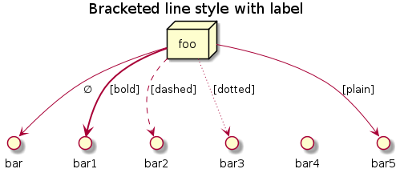

- [Preamble](#org5bfb276)
- [Versions <code>[1/1]</code>](#org62a0f14)
- [Notes](#org55f838a)
  - [Requirements](#org54b0632)
  - [Problem statement](#orgbbc7b5e)
  - [Research](#orgfc4be6f)
    - [Topics <code>[0/3]</code>](#orgaf22996)
    - [Selection](#org5686d6c)
  - [Report](#org1ac1ef0)
    - [Outline <code>[2/8]</code>](#org82aee21)
  - [Marketing Digital Outdoor](#orgdd61310)
    - [Topics](#orgb0b4d3f)
    - [Technologies <code>[0/11]</code>](#org1d0c902)
    - [Problem statement](#org91ee8d6)
    - [Market research <code>[3/3]</code>](#org030a0fc)
    - [Project planning](#org8f5627f)
    - [Analysis](#org01d3f41)
    - [Theoretical foundations <code>[17/17]</code>](#orgb3ece45)
    - [Design](#orgf1b5b65)
- [Diagrams](#org34d332e)
  - [PlantUML](#org6059e6b)
    - [Setup <code>[0/6]</code>](#orgd2db38c)
    - [Workflow <code>[0/4]</code>](#orgb3dc6c3)
    - [Sequence diagrams](#orgfd55264)
    - [Component diagrams](#orge1fe259)
    - [Deployment diagrams](#orgdec9596)
    - [Entity-Relationship diagram](#org98a6e19)
- [GIF generation](#orga0a47a6)
  - [C++ libraries and APIs <code>[0/1]</code>](#org324dee7)


<a id="org5bfb276"></a>

# Preamble

-   This folder contains all the information about the project.
-   It is written incrementally, i.e., as the several project phases take place, the document versions pertaining to each phase are stored in the folder **submission**.


<a id="org62a0f14"></a>

# Versions <code>[1/1]</code>

1.  [X] Problem statement: deadline - <span class="timestamp-wrapper"><span class="timestamp">&lt;2021-10-28 qui&gt;</span></span>


<a id="org55f838a"></a>

# Notes     :Important:


<a id="org54b0632"></a>

## Requirements

-   buildroot
-   c/c++ (both)
-   Device drivers
-   Linux/Raspberry Pi
-   CPS: Cyber-physical systems
-   Makefiles


<a id="orgbbc7b5e"></a>

## Problem statement

Think about the project and deliver a document about it.


<a id="orgfc4be6f"></a>

## Research


<a id="orgaf22996"></a>

### Topics <code>[0/3]</code>

-   [ ] Cyber-physical systems characteristics: <span class="underline">identify the required features for the system</span>
-   [ ] Analyze previous projects to understand what is feasible in terms of Real-time systems using device drivers with Raspberry Pi: <span class="underline">gives an overall idea of what can be achieved</span>
-   [ ] Situate the project requirements, the project constraints


<a id="org5686d6c"></a>

### Selection

-   [Marketing digital Outdoor](readme.md)


<a id="org1ac1ef0"></a>

## Report


<a id="org82aee21"></a>

### Outline <code>[2/8]</code>

1.  [X] Introduction
    1.  Motivation and context
    2.  Problem statement
    3.  Market research
    4.  Goals
    5.  Project planning
    6.  Report outline
2.  [X] Analysis
    1.  Background and state of the art
    2.  Requirements and constraints
    3.  System overview
    4.  System architecture
        1.  HW architecture
        2.  SW architecture
    5.  Subsystems decomposition
        1.  Events
        2.  Use cases
        3.  State machine diagram
        4.  Sequence diagram
    6.  Budget
3.  [ ] Theoretical foundations
4.  [ ] Design
    1.  HW specification
        1.  Block diagram with COTS components, if possible
        2.  List of constraints of functions to be implemented in HW or SW
    2.  HW interfaces definition
        1.  I/O ports
        2.  HW registers
        3.  Memory addresses for shared or I/O by memory mapping
        4.  HW interrupts
    3.  SW specification
        1.  Identify main subsystems
        2.  System tasks
    4.  SW interfaces definition
        -   Define the APIs in detail:
            -   header files with:
                -   functions prototypes
                -   data structure declarations
                -   class declarations
    5.  Start-up/shutdown process specification
    6.  Error Handling specification
5.  [ ] Implementation
6.  [ ] Testing
7.  [ ] Verification/Validation
8.  [ ] Conclusions


<a id="orgdd61310"></a>

## Marketing Digital Outdoor     :Important:


<a id="orgb0b4d3f"></a>

### Topics

1.  Motivation and context
    -   Scenting marketing is a great approach to draw people into stores.
    -   Scent sense is the fastest way to the brain, thus, providing an exceptional opportunity for marketing.
    -   Combining that with additional stimuli, like eye and earing, can significantly boost the marketing outcome.
        
        > -   Knowing your target audience it is critical for the success of stores.
        > -   Marketing can be used to collect, analyse, investigate and decide the best politics for addressing a specific target audience, understanding the its behavioral patterns.
        > -   To understand behavioral patterns <span class="underline">machine-learning models</span> can be used.
2.  Concept
    -   Offer a marketing digital outdoor for brands to advertise and captivate customers
    -   Brands can buy advertisement space and time by sending the following data:
        
        |                         |               |           |          |              |      |
        |------------------------ |-------------- |---------- |--------- |------------- |----- |
        | Digital Outdoor location | Fragrance name | Start Time | Stop Time | Audio Message | Video |
        
        -   The brands can send the data to our company database through our website/application.
        -   The data will then be sent to the marketing digital outdoor using a wireless communication technology.
    -   The advertisement data will be exposed into a display, an audio message transmitted, as well as the indicate fragrance between the designated time interval.
    -   COVID pandemics changed the perspectives about user interaction with the surroundings, with non touch interfaces being preferred. Thus, a non touch user interface is a must have.
    -   When a user approaches the marketing digital outdoor, a proximity sensor will detect it and activate the <span class="underline">user interaction mode</span>.
        -   When activating this mode the camera is started mirroring the user into the display and providing additional options.
        -   In this mode, the user can:
            1.  apply image filters related to the brand
            2.  take pics
            3.  create GIFs
            4.  share them
        -   This mode requires:
            -   Facial detection for image filter application
            -   Hand gesture recognition for navigating the menus and activating options
            -   A virtual keyboard (non-touch) will be provided for user input, by mapping the screen to the keys and waiting for a designated time before accepting it.
            -   A set of hand gestures to be used in user interaction
        -   Several sharing platforms shall be provided namely social media and email.
            -   Tracking the nr of shares provides feedback for the brands in respect of the brand awareness.
            -   Additionally, brands can also monitor this by checking their social media accounts.


<a id="org1d0c902"></a>

### Technologies <code>[0/11]</code>

1.  [ ] Computer vision for facial and gesture recognition (OpenCV)
2.  [ ] Database for marketing digital outdoor management (SQL)
3.  [ ] Website/Application for brands communication to our database
4.  [ ] Wireless communication technology for remote communication with digital outdoors
5.  [ ] Image filter application
6.  [ ] Infrared detection
7.  [ ] Camera recording
8.  [ ] Audio output
9.  [ ] Nebulizer technology for scenting
10. [ ] Screen mapping to keys for virtual keyboard
11. [ ] Social media and e-mail sharing APIs


<a id="org91ee8d6"></a>

### ✔ DONE Problem statement


<a id="org030a0fc"></a>

### ✔ DONE Market research <code>[3/3]</code>

1.  [X] Scenting marketing: trends, market value
2.  [X] Digital Outdoors: quantity, market value
3.  [X] Combined marketing: are they digital outdoor + scenting?


<a id="org8f5627f"></a>

### Project planning

1.  Gantt diagram <code>[0/8]</code>

    1.  [ ] Planning
        -   [ ] Kick-off meeting
        -   [ ] Problem Statement
        -   [ ] Market Research
        -   [ ] Project Planning
    2.  [ ] Analysis
        -   [ ] System overview
        -   [ ] Requirements and constraints
        -   [ ] System architecture
        -   [ ] System Analysis
        -   [ ] Estimated budgets
        -   [ ] Subsystem decomposition
            -   [ ] Events
            -   [ ] Use-cases
            -   [ ] Dynamic operation: state-machine diagram
            -   [ ] Flow of events: sequence diagram
    3.  [ ] Design
        -   [ ] Analysis review
        -   [ ] HW specification
        -   [ ] Component shipping
        -   [ ] Software specification
            -   [ ] Remote client
            -   [ ] Remote server + database
            -   [ ] Local system
    4.  [ ] Implementation
        -   [ ] HW testing
        -   [ ] SW implementation
            -   [ ] Remote client
            -   [ ] Remote server + database
            -   [ ] Local system
        -   [ ] HW implementation
            -   [ ] Breadboard
            -   [ ] PCB design
        -   [ ] System configuration
    5.  [ ] Testing
        1.  [ ] SW unit testing
        2.  [ ] SW integrated testing
        3.  [ ] HW unit testing
        4.  [ ] HW integrated testing
        5.  [ ] Functional testing
    6.  [ ] Verification/Validation
        1.  [ ] Verification
        2.  [ ] Validation
    7.  [ ] Report Writing
        1.  [ ] Problem statement
        2.  [ ] Analysis
        3.  [ ] Design
        4.  [ ] Implementation
        5.  [ ] Final
    8.  [ ] Documentation
        1.  [ ] Problem statement
        2.  [ ] Analysis
        3.  [ ] Design
        4.  [ ] Implementation
        5.  [ ] Testing

2.  Required HW <code>[3/7]</code>

    Research link: <https://www.one-tab.com/page/TZxmVAXJTO6nVyNO593ARA>
    
    -   [X] Raspberry Pi 4: 52 EUR
    -   [X] HDMI screen: 50 EUR - <https://shorturl.at/oyAOR>
    -   [ ] Relay/Transistor + Ultrassonic actuator for nebulizing fragrance
    -   [ ] Audio output
    -   [ ] Power supply
    -   [ ] Mechanical structure
    -   [X] Camera: 14 EUR - <https://shorturl.at/gnpCU>


<a id="org01d3f41"></a>

### ✔ DONE Analysis

1.  System architecture

    **Example**
    
    > BRAND -> DB RC -> RS: q brand Nestle RS -> DB: query brand Nestle DS -> RS: Nestle milka.mp4 milka.wav Chocolate RS -> RC: Nestle milka.mp4 milka.wav Chocolate
    > 
    > COMPANY -> MDO-L Staff member login RC -> RS: q mdo systems RS -> DB: query mdo-systems DB -> RS: std::<vector> mdo<sub>systems</sub> for(i = 0; i < mdo<sub>systems.size</sub>(); i++ ) RS -> RC: mdo<sub>systems</sub>[i] RC -> RC: Select MDO-L machine Send command RC -> RS: mdo <nr> <command> (mdo 1 get mode) RS -> RS: parse command RS -> RS: get mdo<sub>nr</sub> IP (query mdo-systems 1 IP) RS -> MDO-L: connect IP:port MDO-L -> RS: connected RS -> MDO-L: get mode MDO-L -> RS: normal mode (example) RS -> RC: normal


<a id="orgb3ece45"></a>

### ✔ DONE Theoretical foundations <code>[17/17]</code>

1.  [X] **Project methodology: Waterfall model**
2.  [X] **Multitasking and Pthreads**
3.  [X] **Client-Server architecture & TCP/IP & OSI model**
4.  [X] *Daemons*
5.  [X] *Device drivers*
6.  [X] **Nebulizer technology for scenting**
7.  [X] **Computer Vision**
    1.  [X] **OpenCV**
    2.  [X] **Gesture recognition algorithms**
    3.  [X] **Face detection algorithms**
        1.  see [openCV3 book](biblio/OpenCV3_Computer-Vision-in-C++-with-the-OpenCV-Library.pdf) (pg. 883)
8.  [X] **RDBMS (Relational Database management system) (SQL)**
9.  [X] *User detection technologies: IR, ultrasonic*
10. [X] *Camera recording and codecs*
11. [X] *Image filtering APIs*
12. [X] *GIFs generation*
13. [X] **Social media and e-mail sharing APIs**
14. [X] *UI framework: Qt*
15. [X] *File transfer protocols*
16. [X] **Makefiles**
17. [X] **Source code documentation**: Doxygen

Legend:

-   **Ze**
-   *Hugo*


<a id="orgf1b5b65"></a>

### Design

Next Thursday, December 16th, we will have the presentations for the Design Phase. Submit the **presentation** and **report** until Wednesday 15th, 23:00h.

Design Phase must include (some specifications may vary according to your project):

1.  **Hardware Specification** <code>[0/6]</code>:
    -   [ ] Architecture
        -   In the analysis phase an overview of the HW architecture was conceptualized. In this section, a more specific HW architecture is illustrated, using a block-diagram.
        -   BLOCK DIAGRAM and comment it
    -   [-] Hardware Component Specification <code>[7/8]</code>
        1.  [X] Raspberry Pi
            1.  SD card
        2.  [X] Power supply module
        3.  [X] Ultrasonic sensor
        4.  [X] Fragrance diffuser actuator: <https://shorturl.at/hlxFQ>
        5.  [X] LCD display: <https://shorturl.at/dnoIZ>
        6.  [X] Raspberry Pi Camera
        7.  [X] Colunas
        8.  [ ] On/off button
    -   [ ] Peripherals Pinout/Mapping/Connection Layout
        -   Draw a schematic for connecting all HW components
        -   Add a table containing:
            
            |            | PIN MAPPING      |          |
            | Controller | Interface device | Function |
    -   [ ] Test Cases
        -   **Ultrasonic sensor**: one will connect the ultrasonic sensor to Raspberry Pi. Then an object will be approximated to the sensor from several distances with the corresponding distance being measure with a measuring tape. If the distance measured by the sensor and the measuring device are within the error margin provided by the manufactured, the device is compliant.
            
            |        |             |            |                |
            |------- |------------ |----------- |--------------- |
            | HW item | Type of test | Description | Expected result |
    -   [ ] PCB layout (when applicable)
        -   Custom PCB for ultrasonic sensors + fragrance diffuser actuator
    -   [ ] Tools
        -   PADS, KiCad
2.  **Software Specification** <code>[0/11]</code>:
    -   [ ] Entity Relations Diagram
    -   [ ] Classes Diagram
    -   [ ] Data Formats
    -   [ ] Flowcharts
    -   [ ] Tasks Division (accurate plan)
    -   [ ] Thread Priorities
    -   [ ] GUI Layouts
    -   [ ] Test Cases
    -   [ ] Software COTs
    -   [ ] Third-party Libraries/apps
    -   [ ] Tools

It is compulsory to show/identify which/where all class topics are going to be implemented and used by you! Also third-party Libraries/apps must be identified so you can use other's software and materials with our consent.


<a id="org34d332e"></a>

# Diagrams

Diagrams can be drawn using <code>[2/2]</code>:

-   [X] draw.io
    -   User mockups
    -   State-machine
-   [X] [PlantUML](#org6059e6b) (stored in Proj/diags/plantuml)
    -   Sequence diagram
    -   Class diagram
    -   Component diagram
    -   Deployment diag
    -   Entity-Relationship diagram


<a id="org6059e6b"></a>

## PlantUML

[PlantUML](https://plantuml.com/) is a tool for quickly drawing diagrams from text based descriptions. It is specially adequate for sequence diagrams, as draw.io is not very fluid.


<a id="orgd2db38c"></a>

### Setup <code>[0/6]</code>

1.  [ ] Download PlantUML from the [website](https://sourceforge.net/projects/plantuml/files/plantuml.jar/download): `plantuml.jar`
2.  [ ] Place the `plantuml.jar` file into a known directory and add it to the path
3.  [ ] Write a diagram text file in an extension `.pu` (example input/test.pu) - check the user manual for this
4.  [ ] Navigate to the `input` folder using cd
5.  [ ] Generate the diagram from the terminal using:
    
    ```bash
    java -jar plantuml.jar test.pu -o ../out java -jar plantuml.jar test.puput/
    ```
6.  [ ] Check the generate png file: `output/test.png`


<a id="orgb3dc6c3"></a>

### Workflow <code>[0/4]</code>

1.  [ ] Write a diagram text file in an extension `.pu` (example input/test.pu) - check the user manual for this
2.  [ ] Navigate to the `input` folder using cd
3.  [ ] Generate the diagram from the terminal using:
    
    ```bash
    java -jar plantuml.jar test.pu -o ../output/
    ```
4.  [ ] Check the generate png file: `output/test.png`


<a id="orgfd55264"></a>

### ✔ DONE Sequence diagrams

1.  Declaring participants

    If the keyword participant is used to declare a participant, more control on that participant is possible.
    
    The order of declaration will be the (default) order of display.
    
    Using these other keywords to declare participants will change the shape of the participant representation:
    
    1.  actor
    2.  boundary
    3.  control
    4.  entity
    5.  database
    6.  collections
    7.  queue
    
    ```plantuml
      ' title PlantUML (comment)
    @startuml
    
    participant Participant as Foo
    actor       Actor       as Foo1
    boundary    Boundary    as Foo2
    control     Control     as Foo3
    entity      Entity      as Foo4
    database    Database    as Foo5
    collections Collections as Foo6
    queue       Queue       as Foo7
    Foo -> Foo1 : To actor 
    Foo -> Foo2 : To boundary
    Foo -> Foo3 : To control
    Foo -> Foo4 : To entity
    Foo -> Foo5 : To database
    Foo -> Foo6 : To collections
    Foo -> Foo7: To queue
    
    @enduml
    ```
    
    

2.  Change arrow style

    You can change arrow style by several ways:
    
    1.  add a final x to denote a lost message
    2.  use \\ or / instead of < or > to have only the bottom or top part of the arrow
    3.  repeat the arrow head (for example, >> or //) head to have a thin drawing
    4.  use &#x2013; instead of - to have a dotted arrow
    5.  add a final "o" at arrow head
    6.  use bidirectional arrow <->
    
    ```plantuml
    @startuml
    ' comments as needed
    ' lost message
    Bob ->x Alice 
    ' sync message
    Bob -> Alice 
    ' async message
    Bob ->> Alice
    Bob -\ Alice
    Bob \\- Alice
    Bob //-- Alice
    
    Bob ->o Alice
    Bob o\\-- Alice
    
    ' bidirectional message
    Bob <-> Alice
    Bob <->o Alice
    @enduml
    ```
    
    

3.  Grouping messages

    ([src](https://plantuml.com/sequence-diagram#425ba4350c02142c))
    
    It is possible to group messages together using the following keywords:
    
    1.  alt/else
    2.  opt
    3.  loop
    4.  par
    5.  break
    6.  critical
    7.  group, followed by a text to be displayed
    
    It is possible to add a text that will be displayed into the header (for group, see next paragraph 'Secondary group label').
    
    The end keyword is used to close the group.
    
    Note that it is possible to nest groups.
    
    ```plantuml
      ' title PlantUML (comment)
    @startuml
    Alice -> Bob: Authentication Request
    
    alt successful case
    
        Bob -> Alice: Authentication Accepted
    
    else some kind of failure
    
        Bob -> Alice: Authentication Failure
        group My own label
        Alice -> Log : Log attack start
    	loop 1000 times
    	    Alice -> Bob: DNS Attack
    	end
        Alice -> Log : Log attack end
        end
    
    else Another type of failure
    
       Bob -> Alice: Please repeat
    
    end
    @enduml
    ```
    
    

4.  Notes on messages

    It is possible to put notes on message using the note left or note right keywords just after the message.
    
    You can have a multi-line note using the end note keywords.
    
    ```plantuml
    @startuml
    Alice->Bob : hello
    note left: this is a first note
    
    Bob->Alice : ok
    note right: this is another note
    
    Bob->Bob : I am thinking
    note left
    a note
    can also be defined
    on several lines
    end note
    @enduml
    ```
    
    

5.  Divider or separator

    If you want, you can split a diagram using == separator to divide your diagram into logical steps.
    
    ```plantuml
    @startuml
    
    == Initialization ==
    
    Alice -> Bob: Authentication Request
    Bob --> Alice: Authentication Response
    
    == Repetition ==
    
    Alice -> Bob: Another authentication Request
    Alice <-- Bob: another authentication Response
    
    @enduml
    ```
    
    

6.  Lifeline activation and destruction

    The `activate` and `deactivate` are used to denote participant activation.
    
    Once a participant is activated, its lifeline appears.
    
    The activate and deactivate apply on the previous message.
    
    The `destroy` denote the end of the lifeline of a participant.
    
    ```plantuml
    @startuml
    participant User
    
    User -> A: DoWork
    activate A
    
    A -> B: << createRequest >>
    activate B
    
    B -> C: DoWork
    activate C
    C --> B: WorkDone
    destroy C
    
    B --> A: RequestCreated
    deactivate B
    
    A -> User: Done
    deactivate A
    
    @enduml
    ```
    
    

7.  Participant creation

    You can use the `create` keyword just before the first reception of a message to emphasize the fact that this message is actually creating this new object.
    
    ```plantuml
    @startuml
    Bob -> Alice : hello
    
    create Other
    Alice -> Other : new
    
    create control String
    Alice -> String
    note right : You can also put notes!
    
    Alice --> Bob : ok
    
    @enduml
    ```
    
    

8.  Incoming and outgoing messages

    You can use incoming or outgoing arrows if you want to focus on a part of the diagram.
    
    Use square brackets to denote the left "[" or the right "]" side of the diagram.
    
    ```plantuml
    @startuml
    [-> A: DoWork
    
    activate A
    
    A -> A: Internal call
    activate A
    
    A ->] : << createRequest >>
    
    A<--] : RequestCreated
    deactivate A
    [<- A: Done
    deactivate A
    @enduml
    ```
    
    

9.  Anchors and duration

    With `teoz` it is possible to add anchors to the diagram and use the anchors to specify duration time.
    
    ```plantuml
    @startuml
    !pragma teoz true
    
    {start} Alice -> Bob : start doing things during duration
    Bob -> Max : something
    Max -> Bob : something else
    {end} Bob -> Alice : finish
    
    {start} <-> {end} : some time
    
    @enduml
    ```
    
    
    
    You can use the -Pcommand-line option to specify the pragma:
    
    ```bash
    java -jar plantuml.jar -Pteoz=true
    ```

10. Participants encompass

    It is possible to draw a box around some participants, using box and end box commands.
    
    You can add an optional title or a optional background color, after the box keyword.
    
    ```plantuml
    @startuml
    
    box "Internal Service" #LightBlue
    participant Bob
    participant Alice
    end box
    participant Other
    
    Bob -> Alice : hello
    Alice -> Other : hello
    
    @enduml
    ```
    
    

11. Remove foot boxes

    You can use the `hide footbox` keywords to remove the foot boxes of the diagram.
    
    ```plantuml
    @startuml
    
    hide footbox
    title Foot Box removed
    
    Alice -> Bob: Authentication Request
    Bob --> Alice: Authentication Response
    
    @enduml
    ```
    
    

12. Style `strictuml`

    To be conform to strict UML (for arrow style: emits triangle rather than sharp arrowheads), you can use:
    
    ```plantuml
    @startuml
    skinparam style strictuml
    Bob -> Alice : hello
    Alice -> Bob : ok
    @enduml
    ```
    
    

13. Color a group message

    It is possible to color a group message:
    
    ```plantuml
    @startuml
    Alice -> Bob: Authentication Request
    alt#Gold #LightBlue Successful case
        Bob -> Alice: Authentication Accepted
    else #Pink Failure
        Bob -> Alice: Authentication Rejected
    end
    @enduml
    ```
    
    

14. Colors

    You can use specify **fill** and **line** colors either:
    
    1.  with its standard name or CSS name
    2.  using HEX value (6 digits): #RRGGBB
    3.  using HEX value (8 digits) with alpha compositing or RGBA color model: \#RRGGBBaa
    4.  using short HEX value (3 digits): #RGB
    
    ```plantuml
    @startuml
    actor Bob #Red/Yellow
    actor Alice #FF0000/FFFF00
    Alice -> Bob : hello
    @enduml
    ```
    
    

15. All together     :Important:

    This example tries to combine all the most important tips stated previously.
    
    ```plantuml
    @startuml
    ' ---------- SETUP ----------------
    ' strict uml style and hide footboxes
    skinparam style strictuml
    hide footbox
    ' for anchors and duration this may be required (uncomment)
    ' !pragma teoz true
    
    
    ' ---------- Declaring participants
    participant Participant as Foo
    actor       Actor       as Foo1
    boundary    Boundary    as Foo2
    control     Control     as Foo3
    entity      Entity      as Foo4
    database    Database    as Foo5
    collections Collections as Foo6
    queue       Queue       as Foo7
    Foo -> Foo1 : To actor 
    Foo -> Foo2 : To boundary
    Foo -> Foo3 : To control
    Foo -> Foo4 : To entity
    Foo -> Foo5 : To database
    Foo -> Foo6 : To collections
    Foo -> Foo7: To queue
    
    ' -------- Grouping messages ------------------
    ' divider or separator
    ' Encompass actors
    ' add colors to cases
    ' add notes
    == Initialization ==
    
    box "Internal Service" #LightBlue
    participant Bob
    participant Alice
    end box
    Alice -> Bob: Authentication Request
    alt#Gold #LightBlue Successful case
        Bob -> Alice: Authentication Accepted
        note left: this is a first note
    else #Pink Failure
        Bob -> Alice: Authentication Rejected
        note right: this is a 2nd note
    end
    
    == Repetition ==
    
    Alice -> Bob: Another authentication Request
    Alice <-- Bob: another authentication Response
    
    
    Alice -> Bob: Authentication Request
    
    alt successful case
    
        Bob -> Alice: Authentication Accepted
    
    else some kind of failure
    
        Bob -> Alice: Authentication Failure
        group My own label
        Alice -> Log : Log attack start
    	loop 1000 times
    	    Alice -> Bob: DNS Attack
    	end
        Alice -> Log : Log attack end
        end
    
    else Another type of failure
    
       Bob -> Alice: Please repeat
    
    ' ---------- Anchors and duration
    {start} Alice -> Bob : start doing things during duration
    Bob -> Max : something
    Max -> Bob : something else
    {end} Bob -> Alice : finish
    
    {start} <-> {end} : some time
    
    ' --------- Incoming and outgoing messages
    [-> A: DoWork
    
    activate A
    
    A -> A: Internal call
    activate A
    
    A ->] : << createRequest >>
    
    A<--] : RequestCreated
    deactivate A
    [<- A: Done
    deactivate A
    
    ' -------  Participant creation ---------
    Bob -> Alice : hello
    
    create Other
    Alice -> Other : new
    
    create control String
    Alice -> String
    note right : You can also put notes!
    
    Alice --> Bob : ok
    
    '-------- Lifeline activation/deactivation
    participant User
    
    User -> A: DoWork
    activate A
    
    A -> B: << createRequest >>
    activate B
    
    B -> C: DoWork
    activate C
    C --> B: WorkDone
    destroy C
    
    B --> A: RequestCreated
    deactivate B
    
    A -> User: Done
    deactivate A
    
    @enduml
    ```
    
    


<a id="orge1fe259"></a>

### Component diagrams

You can use component diagrams to model the software architecture of a system. Component diagrams provide a view of the physical software components in the system, their interfaces, and their dependencies. [src](https://www.ibm.com/docs/en/rsar/9.5?topic=diagrams-creating-component)

1.  Components

    Components must be bracketed.
    
    You can also use the component keyword to define a component. And you can define an alias, using the as keyword. This alias will be used later, when defining relations.
    
    

2.  UML 2

    UML 2 is the default now.
    
    

3.  Skinparam

    
    
    

4.  Grouping components

    You can use several keywords to group components and interfaces together:
    
    1.  package
    2.  node
    3.  folder
    4.  frame
    5.  cloud
    6.  database
        
        

5.  Full example

    

6.  Mine (to generate report)     :Important:

    You can use several keywords to group components and interfaces together:
    
    1.  package
    2.  node
    3.  folder
    4.  frame
    5.  cloud
    6.  database
        
        


<a id="orgdec9596"></a>

### Deployment diagrams

In UML, deployment diagrams model the physical architecture of a system. Deployment diagrams show the relationships between the software and hardware components in the system and the physical distribution of the processing.

Deployment diagrams, which you typically prepare during the implementation phase of development, show the physical arrangement of the nodes in a distributed system, the artifacts that are stored on each node, and the components and other elements that the artifacts implement. Nodes represent hardware devices such as computers, sensors, and printers, as well as other devices that support the runtime environment of a system. Communication paths and deploy relationships model the connections in the system. ([src](https://www.ibm.com/docs/en/rsar/9.5?topic=diagrams-deployment))

**Types of elements** ([src](https://mychartguide.com/deployment-diagram/#What_are_the_elements_involved)):

1.  Artifact: The artifact is the main element in a deployment diagram and signifies the product developed by any software. It is also often referred to as the information that software generates. It is symbolized with the help of a rectangle.
2.  Association: This helps signify the correlation and message between two different nodes in the diagram.
3.  Component: This helps signify the presence of a software element in the diagram and is represented with a rectangle with two tabs.
4.  Dependency: This signifies the dependency and correlation of one node or component with that of the other in a deployment diagram. It is represented with dashed lines with arrows.
5.  Interface: This signifies the presence of a contractual relationship in a diagram, especially when there are obligations involved that needs to be completed in a total system. It is represented with a circle.
6.  Node: This signifies the main element of any kind of hardware or even software object in a deployment diagram that is further shown with a three dimensional box.
7.  Stereotype: This signifies the element that is trapped inside a node which comes with its representation with the name bracketed by double arrows.

1.  Declaring element

    

2.  Linking or arrow

3.  Line style

    

4.  Nesting

    

5.  Full nesting

    

6.  Style for each nested element

    

7.  Style for all elements

    


<a id="org98a6e19"></a>

### Entity-Relationship diagram

[src](https://plantuml.com/ie-diagram)

1.  Plantuml to MySQL

    [src](https://github.com/grafov/plantuml2mysql)
    
    I liked plantuml tool for UML diagrams but use it also for visualizing structure of relational database. This script loads plantuml class diagram and generates DDL for MySQL SQL dialect. You may define primary keys with # prefix in field name (it means protected field in PlantUML) and define index fields with + (public field in PlantUML) prefix.
    
    Field type noted after field name as is. Also you may use comments after &#x2013;.
    
    For example class definition: will be converted to SQL:
    
    ```sql
    CREATE TABLE IF NOT EXISTS `dummy` (
      id               INT(10) COMMENT 'A comment',
      field1           INT(10),
      field2           VARCHAR(128),
      PRIMARY KEY (id));
    ```
    
    Text between class name and == is table description. The description of the table is mandatory. I was too lazy to check for absence of descriptions but not lazy to write them in each table of my databases.
    
    A line starting with .. or \_\_, used as a separator into a class definition, will be ignored.
    
    The HTML markup in comments (after &#x2013;) is stripped.


<a id="orga0a47a6"></a>

# GIF generation


<a id="org324dee7"></a>

## C++ libraries and APIs <code>[0/1]</code>

1.  [ ] [Magick++](https://www.imagemagick.org/Magick++/Documentation.html):
    -   C++ wrapper for ImageMagick C library
    -   One can user openCV to read frames and convert them to Magick++ structures and them save them as GIFs (see [here](https://stackoverflow.com/questions/41841553/convert-magickimage-to-cvmat) and [here](https://gist.github.com/AlphaNext/20a74d872505a36d514778b9b0719e92))
    -   [research](https://www.one-tab.com/page/fuqT5AkaRZGbzBcehZlXVQ)
